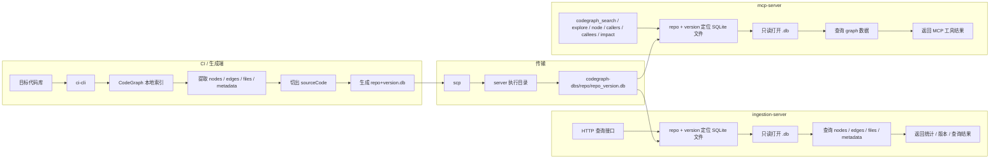

# ci-cli / ingestion-server / mcp-server 改造后流程图

```mermaid
flowchart LR
  subgraph CI[CI / 生成端]
    A[目标代码库]
    B[ci-cli]
    C[CodeGraph 本地索引]
    D[提取 nodes / edges / files / metadata]
    E[切出 sourceCode]
    F[生成 repo+version.db]
    A --> B --> C --> D --> E --> F
  end

  subgraph SCP[传输]
    G[scp]
    H[server 执行目录]
    I[codegraph-dbs/repo/repo_version.db]
    F --> G --> H --> I
  end

  subgraph ING[ingestion-server]
    J[HTTP 查询接口]
    K[repo + version 定位 SQLite 文件]
    L[只读打开 .db]
    M[查询 nodes / edges / files / metadata]
    N[返回统计 / 版本 / 查询结果]
    J --> K --> L --> M --> N
    I --> K
  end

  subgraph MCP[mcp-server]
    O[codegraph_search / explore / node / callers / callees / impact]
    P[repo + version 定位 SQLite 文件]
    Q[只读打开 .db]
    R[查询 graph 数据]
    S[返回 MCP 工具结果]
    O --> P --> Q --> R --> S
    I --> P
  end
```
