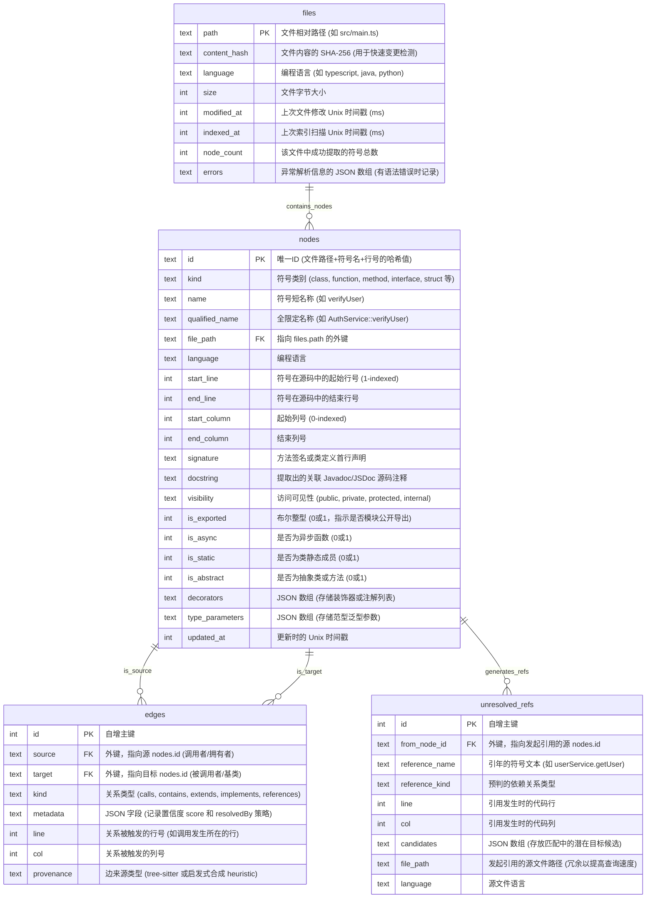
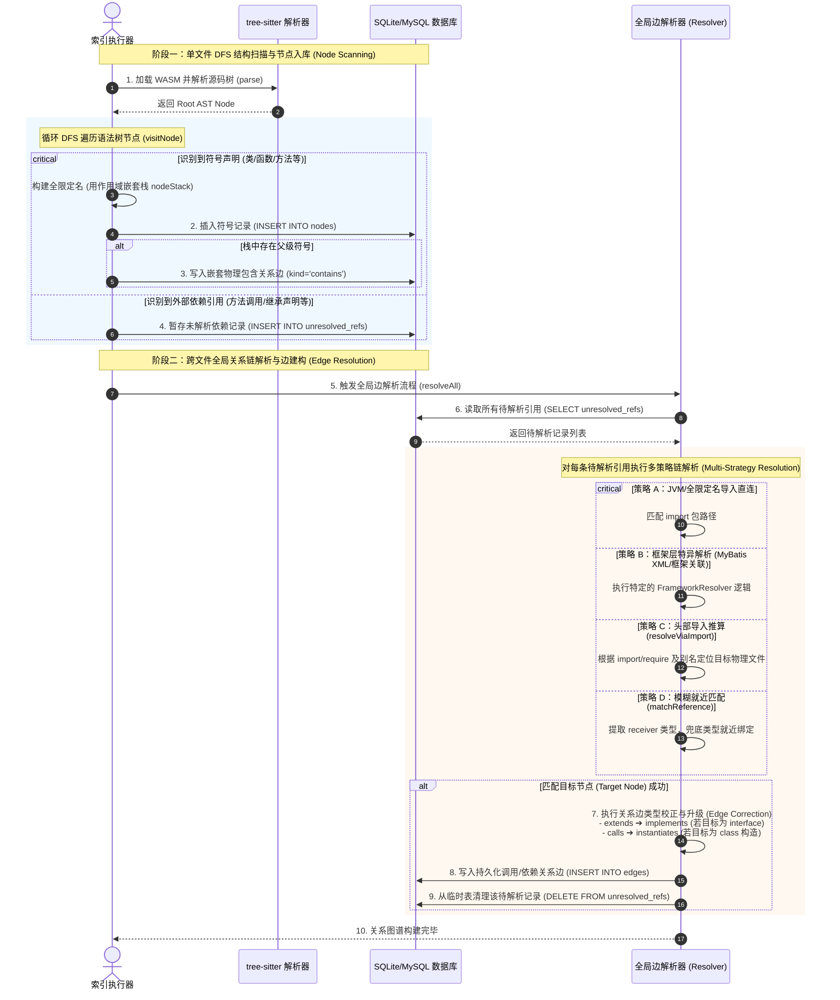
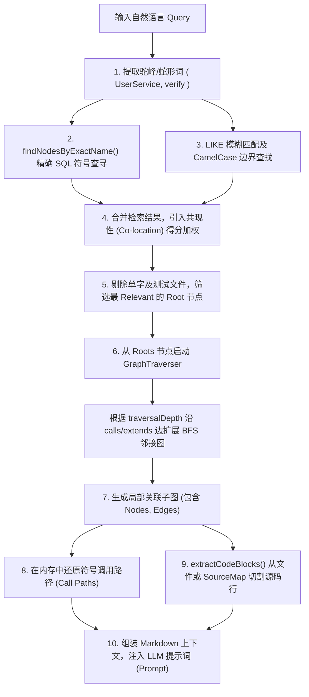
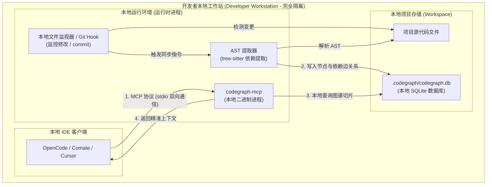
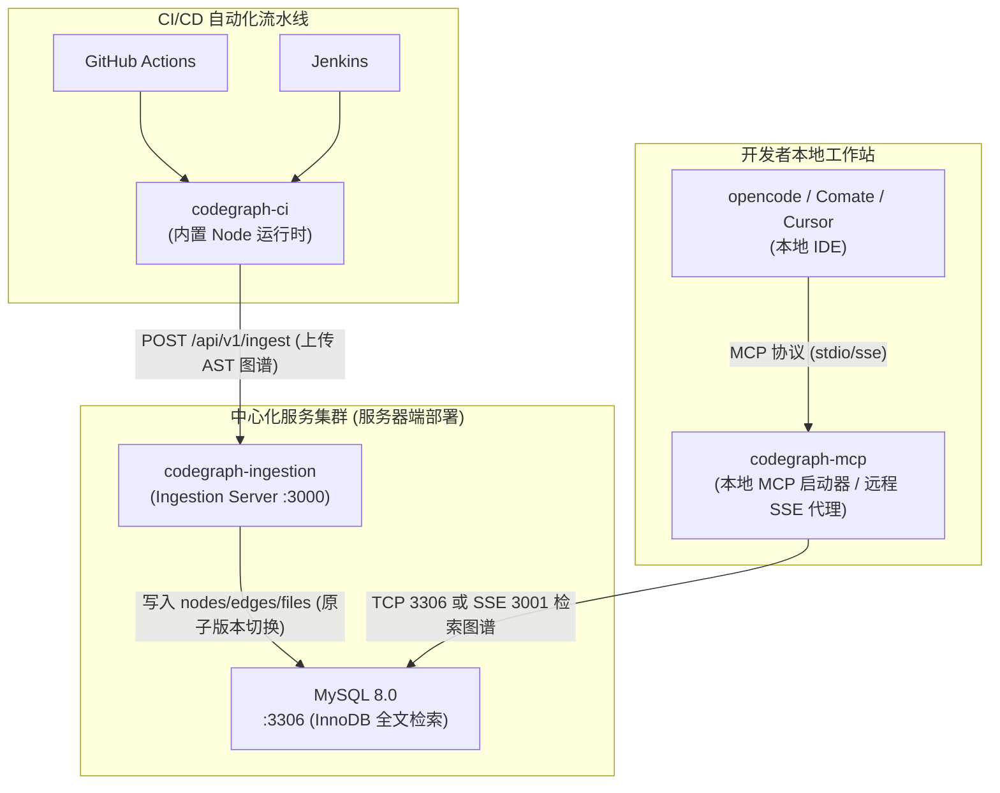

# CodeGraph 技术分享：本地索引与中心化图谱服务使用指南

> **目标受众**: 信息技术部、研发效能团队、各项目开发人员
> **主要内容**: CodeGraph 客户端与服务端的安装、配置、IDE 接入、CI 集成及效能收益分析

---

## 目录

1. [项目概述与核心价值](#1-项目概述与核心价值)
2. [CodeGraph 底层逻辑与技术实现](#2-codegraph-底层逻辑与技术实现)
3. [工具对比与选型分析 (Why CodeGraph)](#3-工具对比与选型分析-why-codegraph)
4. [双重部署架构形态与选型](#4-双重部署架构形态与选型)
5. [提效效果展示](#5-提效效果展示)
6. [如何接入与集成配置](#6-如何接入与集成配置)
7. [常见问题与真实反馈](#7-常见问题与真实反馈)
8. [下一步计划](#8-下一步计划)

---

## 1. 项目概述与核心价值

在研发过程中，大模型 AI 编码助手经常面临以下挑战：
* **大海捞针**: 面临超大型或跨模块的代码库时，AI 助手需要盲目海量翻找文件。
* **上下文崩塌**: 暴力搜索导致上下文包含大量无用代码，从而极易超限，触发全局会话压缩，遗失对话历史。
* **高延迟与高资费**: 发送海量无用 Token 会极大拖慢响应速度，并消耗大量 API Token 费用。

**CodeGraph** 是一款定制的、基于 **AST（抽象语法树）** 的轻量级代码依赖图谱工具。它通过解析代码结构，提取类、函数、方法等“符号”（Nodes）以及它们之间的调用、继承、导入关系“边”（Edges），并在本地或服务端生成关系图谱。

当 AI 助手进行查询时，CodeGraph 通过关联分析为大模型提供**精准的代码切片与上下文**，在降低 Token 消耗的同时，大幅提高大模型在处理复杂逻辑分析时的效率和准确率。

---

## 2. CodeGraph 底层逻辑与技术实现

### 2.1 项目本地持久化与数据库存储架构

当在项目根目录下执行 `codegraph init` 时，系统在本地生成隐藏目录 `.codegraph/`。所有的符号索引、图依赖关系以及增量同步状态均以 SQLite 数据库形式持久化于 `.codegraph/codegraph.db` 中。

#### 2.1.1 磁盘存储结构布局
```
[Your Project Root]/
  ├── .codegraph/
  │    ├── codegraph.db      # 核心 SQLite 数据库 (包含节点、边、FTS虚表)
  │    └── codegraph.lock    # 并发控制锁文件 (防止 CLI、MCP 与 Git Hook 同时写库)
  ├── .cursor/
  │    └── rules/
  │         └── codegraph.mdc # 对接到 Cursor 编辑器的 Agent 规则文件
  └── [Project Files...]
```

#### 2.1.2 数据库实体关系 (ER) 图


---

### 2.2 AST 转换为点与边的调用逻辑

`codegraph` 内部设计了高度模块化的点边抽取引擎，具体处理过程分为两个独立的阶段：

#### 2.2.1 阶段一：基于 DFS 的单文件结构抽取 (AST Extraction)
1. **启动解析**：当执行扫描任务时，系统根据文件后缀调用 `detectLanguage(filePath)`，匹配并加载对应的 `web-tree-sitter` WASM 语言解析器。
2. **深度优先遍历 (DFS)**：调用 `parser.parse(source)` 获得语法树，从语法树 RootNode 启动 DFS。在递归 visitNode 过程中，对照语言配置的规则进行模式匹配。
3. **节点创建**：若节点类型落入符号声明列表（如 TypeScript 的 `class_declaration`），则提取其符号名称。
   - 解析器首先将当前节点 ID 推入作用域嵌套栈 `nodeStack` 中，并利用父级名称生成全限定名（如 `UserService::verifyPassword`），插入 `nodes` 表。
4. **物理嵌套边绑定**：在创建节点时，若 `nodeStack` 中存在父级节点（如类名在栈顶，当前创建的是方法），系统会即时生成一条 `source = parentId`，`target = childId`，`kind = 'contains'` 的物理树级嵌套边，写入临时数组。
5. **依赖引用暂存**：当遇到方法调用（`call_expression`）、继承（`extends_clause`）等无法单文件闭环的交叉符号时，提取其引用的名称（如 `userRepository.save`），写入 `unresolved_refs` 表。

#### 2.2.2 阶段二：跨文件全局符号关系解析 (Reference Resolution)
所有文件扫描完毕、全局符号字典构建好后，调用全局边解析器（Resolver）对每一个暂存的 `unresolved_refs` 进行处理：
1. **JVM 全限定名导入解析**：如果是 Java/Kotlin 等的 `import` 语句，直接利用全限定名索引直连目标 Node，置信度设为 `1.0`。
2. **框架特异解析**：通过注册的 `FrameworkResolver`（如 MyBatis XML 映射等），命中特殊逻辑则生成高置信度结果。
3. **头部导入绑定 (`resolveViaImport`)**：根据发起引用文件头部的 `import` 或 `require` 声明及 TSConfig 中的别名配置，定位目标物理文件，进而在目标文件的导出节点中定位，置信度赋予 `0.9`。
4. **模糊命名匹配 (`matchReference`)**：若均未匹配成功，启动最后的兜底策略。对于带有 receiver 的调用 `obj.method()`，寻找当前作用域内 `obj` 的定义类型，并检索该类型下的成员。如果是裸调用，则采用就近原则在同名节点中匹配。
5. **边升级与校正**：
   - 如果是一条 `'extends'` 边，但解析出的目标是一个 `'interface'`，解析器在生成边时自动将其升级纠正为 `'implements'`；
   - 如果是一条 `'calls'` 边，但目标指向了一个 `'class'`（如调用构造函数），自动将边升级纠正为 `'instantiates'`。
   - 将最终的关系边写入 `edges` 表，同时从临时表清空该 unresolved 记录。

#### 2.2.3 点边生成生命周期时序图



---

### 2.3 查询与召回中的点边命中与原始源码查询

当 LLM 客户端通过 Model Context Protocol (MCP) 输入自然语言 Query 时，`ContextBuilder` 采用以下链路实现高召回、低 Token 损耗的上下文裁剪：



#### 2.3.1 混合搜索 (Hybrid Search) 算法细节
1. **分词与提取**：从 Query 中识别出 `CamelCase`、`snake_case`、`SCREAMING_SNAKE` 等模式以及常规英文单词，剔除无实质意义的介词。
2. **共现性权重提升 (Co-location Boost)**：如果查询提取出两个符号 `UserService` 和 `verify`，而数据库中这两个符号同时出现在同一个物理文件中，系统会根据该文件匹配到的符号数量，呈倍数级提升该批节点的分数。
3. **CamelCase 边界及复合词匹配**：若 FTS 无法直接分词，使用 SQLite 的 `LIKE` 条件进行子串搜索。
   - 对非前缀匹配（例如，在 `TransportSearchAction` 中定位 `Search` 且其前方紧挨着小写字母，代表驼峰分界线），给予 Brevity Bonus（名字越短越好，避免测试工具类篡位）。

#### 2.3.2 源码截取逻辑 (Source Querying)
1. 在提取到的局部子图中，对节点依据重要度降序排队：**种子节点 (Roots) ➔ 方法与函数 (Method/Function) ➔ 类 (Class)**。
2. 调用私有方法 `extractNodeCode(node)`：
   - 校验物理路径是否存在于项目根目录下以防止越权。
   - 执行文件流同步读取：`fs.readFileSync(filePath, 'utf-8')`。
   - 将读取出的内容以换行符 `\n` 切分为数组。
   - 根据 Node 表中记录的起止行号，精确执行 `lines.slice(startLine - 1, endLine)` 切片还原源码。若行数长度超出 Token 限制，强行裁剪并在末尾加 `... (truncated) ...` 标识。

---

### 2.4 根因分析的生产安全合规方案

#### 2.4.1 为什么只用 DB 关系骨架文件行不行？
**结论是：绝对不行。**
* **不可实现 Downstream Grounding**：大模型在回答“为什么这里会崩溃”或者“请帮我重构这个类的实现”时，必须阅读到代码的真实逻辑（如 `if (user == null)` 等分支）。
* **Token 填充需求**：数据库仅记录了符号的坐标（位置）和它们谁调用了谁的指针。如果在召回给 LLM 的上下文中，只告诉它 `UserService.getUser()` 调用了 `UserRepository.find()`，但没有任何具体的实现文本，AI 就失去了推导变量赋值、异常抛出逻辑的基础，无法生成任何准确的重构代码或根因判定。因此，**源码召回组件是图谱发挥 AI 诊断威力的物理基础。**

#### 2.4.2 生产合规安全内存召回三方案
针对银保监合规要求“生产环境不得存留、解密源码物理文件”的底线，CodeGraph 设计了三套高安全等级的内存召回方案：

1. **方案一：SourceMap `sourcesContent` 内存还原（前端/NodeJS 业务）**
   * **操作流程**：构建机在打包压缩混淆 Node.js 项目时，生成包含源码文本的 `.js.map` 符号包。将该 map 包部署于生产，但不部署任何 `src/` 原始代码。
   * **合规逻辑**：审计部门将 `.map` 视作编译调试辅助文件，而非代码仓库。排查问题时，CodeGraph 直接解析 map 文件的 JSON 结构，并从 `sourcesContent` 属性中提取对应原始文件索引的内容，全程在内存中进行 line slice 裁剪，**磁盘上完全不生成任何明文源码物理文件**。
2. **方案二：制品库 Source JAR 结合方案（Java 后端业务）**
   * **操作流程**：
     1. 在 CI/CD 构建阶段，在安全流水线内生成只读源码包 `app-sources.jar`，并将其发布到企业隔离受控的安全制品库（如 Nexus）。
     2. 生产运行容器内只部署 `app.jar` 字节码包和由 CI 扫描导出的 `codegraph.db` 关系数据库，磁盘源码率为零。
     3. 当 SRE 在生产发起大模型根因诊断时，诊断程序获得临时授权访问内网制品库，流式拉取 `app-sources.jar` 的二进制流。
     4. 在内存中解压指定类文件，读取行切片传递给 LLM。**排查进程退出后垃圾回收 (GC) 直接销毁内存，阅后即焚**。
3. **方案三：内存 Fernflower 反编译与 Mapping 还原（极致安全审计）**
   * **操作流程**：针对任何地方都不允许存放源码压缩包的极端监管场景，诊断工具在内存中动态加载字节码反编译器组件。
   * **还原逻辑**：直接读取运行中的 `.class` 二进制字节码，在内存中反解出原始逻辑。若代码经过 ProGuard / R8 混淆，则读入打包发布的脱敏 `mapping.txt` 文件，在内存中完成符号重映射（把反编译代码里的 `a.b.c.a` 复原为 `UserService.verify`），再对照 `LineNumberTable` 切割出出错行，实现无损的逻辑诊断。

---

## 3. 工具对比与选型分析 (Why CodeGraph)

为了给信息技术部提供坚实的决策依据，我们在技术预研阶段对行业及学术界主流的代码导航/定位方案进行了全方位调研。我们将自研定制的 **CodeGraph** 与企业级源码检索平台 **GitNexus** 以及重型反向工程工具 **Understand-Anything** 进行了对比选型：

### 3.1 主流技术方案选型对比表

| 对比维度 | 本地与轻量化图谱：CodeGraph | 企业级全局搜索：GitNexus | 架构逆向分析专家：Understand-Anything |
| :--- | :--- | :--- | :--- |
| **设计定位** | **代码依赖图谱与 IDE 本地 MCP 引擎** | **企业级代码搜索与仓库索引平台** | **代码逆向分析与规约自动生成系统** |
| **核心目的** | 为开发者 IDE（OpenCode, Comate, Cursor）提供**高精度、低延迟的依赖上下文与调用链分析**。 | 提供企业内所有代码库的**全局文本搜索、依赖扫描与代码浏览器服务**。 | 对未知、无说明的庞大遗留代码进行**自动化模块指纹提取、架构逆向与规约生成**。 |
| **运行机制** | **确定性的静态 RAG 召回**：通过 AST 解析构建类/函数依赖，利用混合搜索（精确、模糊、共现权重） + 快速关系拓扑扩展，一次性找出最优的上下文子图交付给 AI。 | **重型仓库索引与文本搜索**：通过集中式的后台解析服务器和弹性搜索（Elasticsearch），进行全公司仓库的正则/文本搜索。 | **多 Agent 分析管线**：通过基于 pnpm 顶层的工作区依赖分析、增量模块指纹构建和递归 AST 扫描进行多智能体协同逆向。 |
| **知识图谱特征** | **分层关系关联图 (SQLite/MySQL)**：结合静态 AST 语法树解析与启发式框架层解析（如 MyBatis XML SQL 关联等）。 | **文本与依赖关联索引**：偏向于文件级、依赖包维度的元数据关联，不支持细粒度方法级调用图多跳分析。 | **AST 模块指纹与依赖矩阵**：专注于大型项目的模块拓扑结构、Zod Schema 校验与接口规约定义。 |
| **部署与使用** | **极轻量**：支持本地 Local 模式（零服务器依赖，解压即用）与中心化 Server 模式。原生支持 MCP 协议。 | **重型部署**：需要在服务器端搭建庞大的集中式数据库与搜索引擎，本地开发环境无法离线独立运行。 | **中重型**：适用于架构分析阶段的 CLI 服务，通常作为离线任务运行，难以在 IDE 开发中实时响应。 |
| **使用成本** | **极低**。一次性生成本地/中央索引，后续只需在本地毫秒级执行 SQL 和 BFS 连线，零额外大模型开销。 | **中等**。大范围全局搜索和持续索引更新对服务器算力和存储要求极高。 | **较高**。逆向工程需要大量的扫描和多 Agent 分析链配合，产生较多的大模型 Token 费用。 |
| **数据安全性** | **极高**。本地 SQLite 图谱数据 100% 不出开发机，中心化模式下亦支持 SSE 代理直连。 | **中等**。需要将公司所有源码完整同步并存储在 GitNexus 中央索引服务器上。 | **高**。主要在本地工作区或受控流水线中运行，但多 Agent 分析时涉及 Token 传输。 |
| **推荐选型场景** | **首选推荐**。适合作为各项目组开发人员的 IDE 编程助手，极大提升跨文件和重构场景 of AI 问答质量。 | 适合用作全公司跨部门、跨系统的代码资产搜索和全局包依赖管理。 | 适合用于遗留代码清点、模块化重构、系统逆向文档补充。 |

### 3.2 选型定位总结词

> 💡 **架构选型总结金句**：
> “**GitNexus** 是覆盖全公司的 **‘全局代码搜索引擎与地图浏览器’**；**Understand-Anything** 是专注于大型模块反解析与大模块级规范生成的 **‘架构重构设计院’**；而 **CodeGraph** 则是为我们每个开发者的主力 AI 编码助手绘制全局数字路线、进行爆炸半径预测与架构避障的 **‘高精地图定位雷达 (MCP Infrastructure)’**。基于我们团队对本地离线开发、低 Token 成本以及 IDE 实时高频问答的核心需求，CodeGraph 是目前研发提效的最佳接入选择。”

---

## 4. 双重部署架构形态与选型

为了满足不同研发场景对计算资源、网络隔离及多人协同的要求，定制后的 CodeGraph 支持两种主流部署形态：

### 4.1 原生本地二进制形态 (Local MCP 模式)

* **架构特点**: 
  CodeGraph 以本地可执行二进制文件形式存在，作为开发人员本地机器 of 子进程启动，通过标准 `stdio` 协议与本地 IDE（如 OpenCode、Comate、Cursor）交互。
  
* **系统架构图 (Mermaid)**:



* **数据存储**: 
  所有的 AST 代码依赖图谱、调用链关系与文件索引元数据均存储在本地项目根目录下的 `.codegraph/` 目录中的 SQLite 数据库（`codegraph.db`）内，数据100%不出本机。
* **开发接入**: 
  我们针对行内常用的 AI 编码助手进行了专门的适配（例如 `Comate` 和 `OpenCode`），能够大幅提升本地 AI 引擎的上下文智能检索能力。

### 4.2 中心化服务端形态 (Server / Centralized 模式)

* **架构特点**: 
  采用**“CI 自动提取 + 中央服务入库 + 全员共享查询”**的中心化星型拓扑架构。其核心组件与数据流向如下图所示：



* **工作机制**:
  1. **流水线自动索引**: CI 服务器（Jenkins）在代码合并/提交时触发，调用 `codegraph-ci` 增量提取 AST 图谱数据，打包并通过 `POST` 上传。
  2. **版本原子切换**: `codegraph-ingestion` 接收数据后写入 MySQL 并自动在分支维度秒级原子切换到最新版本，保证多分支多版本并存。
  3. **客户端远程查询**: 开发者的 IDE 通过 `codegraph-mcp` 查询中心化 MySQL。开发者本地无需执行复杂的 AST 解析，不占用本地 CPU 和内存。

### 4.3 部署形态选型指南

| 选型维度 | 本地二进制形态 (Local MCP) | 服务端形态 (Centralized Server) |
| :--- | :--- | :--- |
| **存储数据库** | 本地 SQLite (`codegraph.db`) | 集中式 MySQL 8.0 (InnoDB) |
| **本地资源开销** | 较高（解析 AST 及构建依赖树需要消耗大量 CPU/内存） | 极低（仅执行轻量级网络查询） |
| **网络要求** | **完全离线**，100% 独立运行 | 需要连接公司内网（需访问 Ingestion/MySQL） |
| **最新索引同步** | 需开发者本地拉取代码后手动或通过 Hook `sync` 重建 | **完全自动**，代码合并后 CI 自动上传，全组即刻共享 |
| **多项目管理** | 独立管理，各项目目录隔离存储 | 统一管理，支持多仓库、多分支多版本并存 |
| **安全性** | 源码及数据完全不出开发机 | 数据存储在中心 MySQL，支持 SSE 代理免数据库端口暴露 |
| **推荐选型场景** | 适合临时测试、个人工具升级或在无内网环境开发时使用 | **团队协作首选**，适合主流项目、大型仓库的常态化团队开发提效 |

---

## 5. 提效效果展示

### 5.1 核心指标量化对比

在进行深层跨模块逻辑分析（如“LDAP 如何工作”、“短信通道配置”）时，使用 CodeGraph 前后的性能对比：

| 指标维度 | 未使用 CodeGraph | 使用 CodeGraph | 效能提升比例 |
| :--- | :--- | :--- | :--- |
| **Token 消耗** | **> 262,512** Tokens | **79,326** Tokens | **降低约 70%** |
| **单次问答耗时** | **11 分 46 秒** | **4 分 58 秒** | **速度提升约 60%** |
| **检索方式** | 盲目暴力遍历搜索文件 | 精准依赖符号及关联调用链定位 | **精准检索** |


### 5.2 未使用 CodeGraph 的效能痛点

* **Token 消耗膨胀**: 随着多轮问答进行，无用上下文迅速堆叠 ($28562 \rightarrow 90285 \rightarrow 56021 \rightarrow 87644$)，触发全局会话压缩。
  
  
  
* **问答响应缓慢**: 由于输入 Token 过大，API 响应时间达到 11 分 46 秒。
  
  
  
* **文件暴力搜索**: 触发大模型漫无目的海量搜索文件，带来巨大的网络与 API 网关带宽压力。
  
  

### 5.3 使用 CodeGraph 后的实际效能表现

* **响应速度提升**: 精准图谱切片使 API 交互数据骤降，耗时减少到 4 分 58 秒。
  
  
  
* **精准文件检索**: 仅搜索与 LDAP 直接相关的类与方法，避免载入无关代码。
  
  

### 5.4 IDE 实际问答提效图示

* **OpenCode 场景下调用**: 
  输入“ldap 如何工作的”，在执行链路中可看到 Agent 精准调用 `codegraph_codegraph_explore` 进行快速分析定位，成功展示 LDAP 核心类的实现架构。
  
  
  

* **Comate 场景下调用**:
  输入 `how does ldap work`，自动调用 CodeGraph MCP 工具返回 LDAP 的类树关系。
  
  

---

## 6. 如何接入与集成配置

### 6.1 客户端环境要求与 CLI 安装

1. **环境准备**:
   * 安装 Node.js `> 18.x`，可从内网下载解压：[内网 Node.js 下载地址](http://sync.qa.bx/card/api/v1/homeController/downloadFile.do?fileId=ec77b74316ca43039fc457519b52e29b)。
   * 将解压目录配置到系统环境变量 `Path` 中（可通过 `sysdm.cpl` 配置）。
2. **CLI 工具安装**:
   在 CMD 或 Terminal 中执行：
   ```bash
   # 设置内网 npm 镜像源
   npm set registry http://maven.qa.bx:9090/repository/bxbank_npm-group/
   # 执行交互式安装
   npx @colbymchenry/codegraph@1.1.6
   ```
   * 安装向导中依次选择：安装在目标 Agent -> `Yes` -> `All projects` -> `Yes` -> `Yes` -> `Yes`。

### 6.2 OpenCode 客户端配置

1. **移动引导文件**: 将项目根目录下生成的 `AGENTS.md` 移动到新建的 `agents/` 目录中。
   * 路径：`项目根目录/agents/AGENTS.md`
2. **检查配置文件**:
   * **配置文件路径**:
     * **Windows**: `C:\Users\<您的用户名>\.config\opencode\opencode.json`
     * **macOS/Linux**: `~/.config/opencode/opencode.json`
     
     
     
   * 检查 `opencode.json` 中是否包含以下 `codegraph` 本地服务配置段：
     ```json
     {
       "mcp": {
         "codegraph": {
           "type": "local",
           "command": [
             "codegraph",
             "serve",
             "--mcp"
           ],
           "enabled": true
         }
       }
     }
     ```
     
     

### 6.3 Comate 客户端配置

1. **本地图谱初始化**: 
   在项目根目录下打开 Terminal，执行：
   ```bash
   codegraph init
   ```
2. **开启 MCP 面板**:
   在 Comate 聊天面板右上角点击 **`...` (更多)** 按钮，选择 **`MCP`**，确保 MCP 开关处于开启状态。
   
   
   
3. **写入 MCP 服务器配置**:
   在 Comate 配置项或全局 `mcpServers.json` 中配置本地 stdio 协议：
   ```json
   {
       "mcpServers": {
           "codegraph": {
               "type": "stdio",
               "command": "codegraph",
               "args": [
                   "serve",
                   "--mcp"
               ],
               "enabled": true,
               "disabled": false
           }
       }
   }
   ```

### 6.4 CI/CD 流水线与 Webhook 自动化集成

1. **本地 Git Webhook 触发**:
   双击运行项目中的 `setup-git-hooks.sh`。它将在 `.git/hooks/post-commit` 中添加同步钩子，使开发人员每次在本地执行 `git commit` 时都会触发自动后台增量同步 `codegraph sync`。
2. **CI 增量状态监控**:
   在流水线中使用 `codegraph status --json` 命令监控索引健康状况。若出现节点数异常，可采用强制索引指令 `codegraph index --force` 进行全量重建。

### 6.5 中心化部署 Explorer API 接入

可由 IT 部门统一部署 Ingestion Server，团队通过 REST API 交互：
* **API 请求地址**: `POST http://10.88.160.129:3001/api/explore`
* **Header**: `Content-Type: application/json`
* **入参 Payload 示例**:
  ```json
  {
      "repo": "bxbank/MSC/msgcenter",
      "branch": "Release_251210_MSC",
      "query": "sendWeixinTemplate",
      "maxFiles": 6
  }
  ```

* **Curl 命令行调用示例**:
  ```bash
  curl -X POST http://10.88.160.129:3001/api/explore \
    -H "Content-Type: application/json" \
    -d '{
      "repo": "bxbank/MSC/msgcenter",
      "branch": "Release_251210_MSC",
      "query": "sendWeixinTemplate",
      "maxFiles": 6
    }'
  ```
  
  

### 6.6 Agent 引导配置 (Skill / AGENTS.md 规范)

当使用中心化/远程 API 模式时，为了让 AI 智能体（如 OpenCode, Cursor）能够智能、规范地使用这些接口，**必须**为 Agent 配置使用规则指南。
中心化模式的一项关键区别是：**所有图谱 MCP 工具都需要额外传入 `repo`（代码库标识）与 `branch`（分支名）参数**。必须通过引导配置将这些参数和备用调用路径告知 AI。

#### 方法一：配置 opencode 专用 Skill（推荐）

通过为 OpenCode 建立专用的 Skill，能将工具引导规约和 API 接入指令深度植入 AI 的系统 Prompt 之中。

1. 在开发机本地创建 Skill 描述文件：`~/.gemini/config/skills/codegraph/SKILL.md`（若目录不存在请手动创建）。
2. 在该文件中写入以下规约内容（已内置 Curl 备用调用路径）：

```markdown
---
name: codegraph
description: 当用户提出有关代码结构、符号关系、调用链路（主调/被调）、改动影响范围（影响半径）、项目架构分析，或者需要在已安装 CodeGraph 的项目中搜索代码时，使用此技能。
---

# CodeGraph 中心化服务技能指南

本技能指导 AI 智能体（Agent）如何使用 CodeGraph 中心化服务进行语义代码分析。

## 关键区别 — 中心化模式

中心化服务模式下，所有图谱查询工具都需要额外提供 `repo` 和 `branch` 参数。针对当前项目，请使用以下固定值：
- `repo`: "bxbank/MSC/msgcenter" *(请根据实际项目替换)*
- `branch`: "Release_251210_MSC" *(请根据当前开发分支替换)*

## HTTP REST API 备用接入路径 (Curl 调试)

当本地 MCP 工具异常时，你可通过执行 Shell 的 `curl` 命令直接访问后端 API：
```bash
curl -s -X POST http://10.88.160.129:3001/api/explore \
  -H "Content-Type: application/json" \
  -d '{
    "repo": "bxbank/MSC/msgcenter",
    "branch": "Release_251210_MSC",
    "query": "<替换为实际要搜索的符号或问题>"
  }'
```

## 工具选择与使用场景

| 查询意图 | 推荐工具 | 最佳实践 |
| :--- | :--- | :--- |
| **首要工作流**："X 是如何工作的？"、架构总览、链路追踪 | `codegraph_explore` | **首选工具**。单次调用即可返回相关符号源码，按文件分组。 |
| **调用链路**："X 是如何调用到 Y 的？" | `codegraph_explore` | 传入链路中的关键符号名。 |
| **快速定位符号**："找到 X 的定义" | `codegraph_search` | 比 grep 快得多，返回位置 and 签名。 |
| **追踪主调函数**："谁调用了 X？" | `codegraph_callers` | 查找所有调用者。 |
| **追踪被调函数**："X 调用了谁？" | `codegraph_callees` | 展开所有子调用。 |
| **影响分析**："修改 X 会影响哪些地方？" | `codegraph_impact` | 自动计算传递依赖的爆炸半径。 |
| **获取源码**："查看 X 的完整代码" | `codegraph_node` (设 `includeCode: true`) | 返回所有重载版本。 |
| **文件结构**："项目里有哪些文件？" | `codegraph_files` | 快于文件系统扫描。 |
| **版本查询**："有哪些图谱版本？" | `codegraph_versions` | 列出最近 7 个版本。 |

## 反面模式（Agent 行为规范）

- ❌ 不要用 grep 重复校验 CodeGraph 结果 — 结果由 AST 分析得出，直接信任。
- ❌ 不要循环调用 `codegraph_node` — 改用 `codegraph_explore` 一次查多个。
- ❌ 不要让 Agent 自行发散查找 — 直接使用工具获取代码。
```

#### 方法二：配置本地或全局 `AGENTS.md` 指导书

若未启用 Skill 系统，则可以通过配置项目本地或全局的 `AGENTS.md` 规约文件引导 AI 助手：

1. **配置文件路径**:
   * **全局配置路径**: `~/.config/opencode/AGENTS.md`
   * **项目本地路径**: `项目根目录/agents/AGENTS.md`
2. **配置规约**:
   在 `AGENTS.md` 中写入以下配置块，并在外侧使用 `<!-- CODEGRAPH_START -->` 和 `<!-- CODEGRAPH_END -->` 注释标记进行包裹：

```markdown
# CodeGraph 开发者指示书 (OpenCode 专用)

本指示引导 AI 助手如何通过 CodeGraph 服务检索本地与中心化图谱库。

<!-- CODEGRAPH_START -->
## 中心化服务运行环境
所有图谱查询工具已部署至中央集群，工具接口需要额外提供 `repo` 与 `branch` 参数：
- `repo`: "bxbank/MSC/msgcenter"
- `branch`: "Release_251210_MSC"

## HTTP REST API 备用接入路径 (Curl 调试)
如果 MCP 连接异常或未注册 MCP 插件，你可以使用 shell `curl` 进行快捷查询：
```bash
curl -s -X POST http://10.88.160.129:3001/api/explore \
  -H "Content-Type: application/json" \
  -d '{
    "repo": "bxbank/MSC/msgcenter",
    "branch": "Release_251210_MSC",
    "query": "<检索词/方法名/符号>"
  }'
```

## 工具选择与最佳实践

| 查询意图 | 推荐工具 | 最佳实践 |
| :--- | :--- | :--- |
| **架构总览与逻辑流程分析** | `codegraph_explore` | 优先通过 `codegraph_explore` 进行快速分析，它会返回完整的源代码切片。 |
| **查询方法定义与位置** | `codegraph_search` | 不要使用 grep 暴力检索。 |
| **影响范围与爆炸半径计算** | `codegraph_impact` | 查找修改某处代码对下游依赖的影响。 |

## 行为限制与反面模式
- ❌ 直接信任 AST 关系分析，不要使用 grep 重复检查 CodeGraph 结果。
- ❌ 尽量避免循环读取文件，使用更顶层的图谱接口替代。
<!-- CODEGRAPH_END -->
```

---

## 7. 常见问题与真实反馈

### 7.1 常见问题解答 (FAQ)

* **Q1: 本地建图会对代码隐私构成威胁吗？数据会出局吗？**
  **完全不会**。本地 Local MCP 模式下，所有的 AST 数据分析、关系提取均在本地执行，生成的图谱数据库存在于您本地项目根目录下的 `.codegraph/codegraph.db`（SQLite）中，**数据完全不出开发机**。
* **Q2: 在 OpenCode 聊天时报错“无 codegraph mcp”？**
  请依次排查：(1) 是否遗漏了将 `AGENTS.md` 放入 `agents/` 目录；(2) 检查 `opencode.json` 的路径以及配置语法是否正确。
* **Q3: 频繁在不同分支间切换，本地索引需要重建吗？**
  在大范围切换分支或执行 `git reset` 时，不会触发 `commit` Webhook。此时建议在 IDE 终端中手动运行 `codegraph sync` 快速进行增量补齐同步。

### 7.2 内部开发团队真实反馈

在小范围灰度与试点团队接入后，我们收集到了来自不同研发角色的反馈：

> 💬 **前端研发工程师 (开发 A)**:
> *"之前在 OpenCode 问一个跨模块的接口调用链，AI 经常会卡住 10 分钟以上，有时甚至因为上下文太大报会话压缩把刚才的聊天纪录全冲掉了。现在引入 CodeGraph 查图谱，响应缩短了一倍以上，基本上不触发会话压缩了，返回的代码定位非常精准。"*

> 💬 **服务端系统架构师 (开发 B)**:
> *"由于本地大项目建图时 tree-sitter 提取 AST 对本机的 CPU 负载较高，我们非常推崇 Ingestion Server + MySQL 的中心化模式。CI 部署好之后，把 Ingest 上传加到 Jenkins 自动流水线上，开发本地只需要在 MCP 里配置一行远程服务 URL 就行，本地不费任何资源就能享受到最新的图谱，适合大规模推广。"*

> 💬 **研发效能专家 (效能 C)**:
> *"从效能网关监控看，由于精准的代码上下文召回，AI 助手的 Token 平均消耗降低了近 70%。这不仅极大减少了开发人员等待响应的焦虑，长远看对于公司采购 AI 平台 Token 额度的费用也是一次巨大的‘降本控流’。"*

---

## 8. 下一步计划

为了让 CodeGraph 服务于更广泛的开发团队，我们效能团队计划从以下几个方向推进：

1. **大力推广远程 SSE 免部署代理服务**:
   推行 Mode B（远程 SSE 模式）。开发本地不需要安装 Node.js 和解压 CLI 二进制包，只需要在 IDE 中一键粘贴中心化 SSE URL 地址即可即开即用，将接入难度降为零。
2. **多语言 AST 提取精细化升级**:
   在目前的 JS/TS、Java 支持基础上，进一步引入 C++、Golang、Python 的 tree-sitter 依赖深度提取算法，适配公司内部更多的业务技术栈。
3. **CI/CD 流水线标准化集成插件开发**:
   开发通用的 Jenkins Pipeline 共享库插件，让各个业务项目组在流水线配置文件中仅需配置一行指令，即可实现代码合并后全自动更新图谱。
4. **图谱检索与 Agent 推理结合的算法调优**:
   优化 Ingestion 端接收图谱时的语义联想匹配与关联搜索深度，提升多轮问答下大模型对隐式方法调用和接口继承关系的解析准确度。
