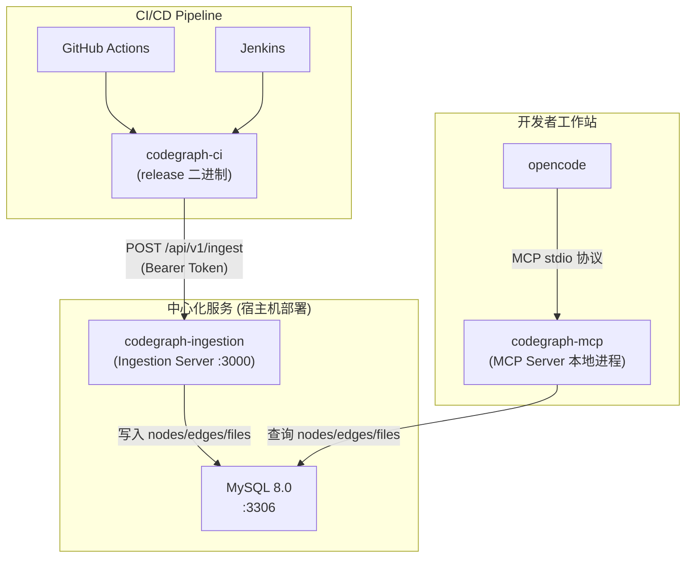
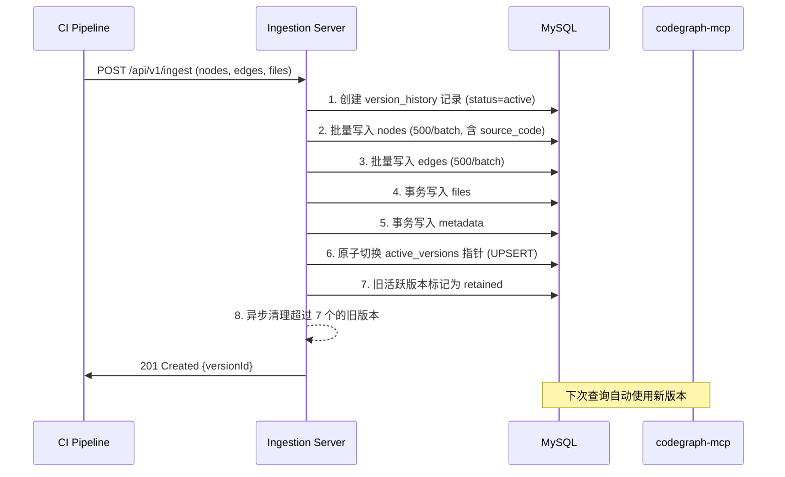

# CodeGraph 私有化安装配置使用手册

> **版本**: v0.9.9 | **最后更新**: 2026-06-11

---

## 目录

1. [系统架构概览](#1-系统架构概览)
2. [环境要求与前置依赖](#2-环境要求与前置依赖)
3. [Release 安装包说明](#3-release-安装包说明)
4. [服务端部署](#4-服务端部署)
5. [CI/CD 集成 — 代码图谱自动入库](#5-cicd-集成--代码图谱自动入库)
6. [opencode 客户端配置](#6-opencode-客户端配置)
7. [MCP 工具详解](#7-mcp-工具详解)
8. [版本管理机制](#8-版本管理机制)
9. [API 参考](#9-api-参考)
10. [运维与故障排查](#10-运维与故障排查)
11. [安全加固建议](#11-安全加固建议)
12. [附录：支持的语言与框架](#12-附录支持的语言与框架)

---

## 1. 系统架构概览

CodeGraph 私有化部署采用 **中心化服务架构**，将代码知识图谱存储在 MySQL 中，供全团队通过 AI 编辑器查询使用。



### 核心组件

| 组件 | 对应二进制 | 职责 |
|------|-----------|------|
| **Ingestion Server** | `codegraph-ingestion` | 接收 CI 上传的图谱数据，写入 MySQL，管理版本 |
| **MCP Server** | `codegraph-mcp` | 暴露 MCP 工具给 opencode，从 MySQL 查询图谱 |
| **CI CLI** | `codegraph-ci` | 在 CI 流水线中提取代码图谱并上传至 Ingestion Server |
| **Local CLI** | `codegraph` | 本地核心命令行工具，用于单机模式的初始化、状态查询、索引等 |
| **MySQL 8.0** | — | 存储代码图谱（节点、边、文件、元数据），支持全文检索 |

### 数据流

```
代码提交 → GitHub Actions / Jenkins 触发构建
  → codegraph-ci 提取 AST 图谱 → POST 上传 → Ingestion Server
  → 写入 MySQL (原子版本切换)
  → opencode 通过 codegraph-mcp 查询图谱
```

---

## 2. 环境要求与前置依赖

### 服务端（运行 Ingestion Server + MySQL）

| 依赖 | 版本要求 | 备注 |
|------|---------|------|
| **MySQL** | 8.0+ | 需要 InnoDB 全文索引支持 |
| **磁盘空间** | ≥ 10GB | 根据代码库规模调整 |
| **内存** | ≥ 4GB | MySQL + Ingestion Server 共享 |
| **操作系统** | Linux x64/arm64 | 推荐 Ubuntu 20.04+ / CentOS 8+ |

> [!IMPORTANT]
> Release 安装包 **自带 Node.js 运行时**，服务端**无需安装 Node.js**。

### CI 构建节点

| 依赖 | 说明 |
|------|------|
| **codegraph-ci 二进制** | 从 release 包中获取，自带运行时 |
| **网络访问** | 需能访问 Ingestion Server |

> CI 节点同样 **无需安装 Node.js**——`codegraph-ci` 二进制自带运行时。

### 开发者工作站

| 依赖 | 说明 |
|------|------|
| **codegraph-mcp 二进制** | 从 release 包中获取，自带运行时 |
| **opencode** | AI 编辑器 |
| **网络访问** | 需能访问 MySQL 服务器 |

---

## 3. Release 安装包说明

### 3.1 可用的安装包

Release 目录下提供以下平台的安装包：

| 文件 | 平台 | 大小 |
|------|------|------|
| `codegraph-linux-x64.tar.gz` | Linux x86_64 | ~54MB |
| `codegraph-linux-arm64.tar.gz` | Linux ARM64 | ~54MB |
| `codegraph-darwin-x64.tar.gz` | macOS Intel | ~50MB |
| `codegraph-darwin-arm64.tar.gz` | macOS Apple Silicon | ~50MB |
| `codegraph-win32-x64.zip` | Windows x64 | ~60MB |
| `codegraph-win32-arm64.zip` | Windows ARM64 | ~60MB |

### 3.2 安装包内容结构

```
codegraph-<platform>/
├── node                           # 内置 Node.js 运行时 (v24)
├── bin/
│   ├── codegraph                  # 主命令 (本地模式使用)
│   ├── codegraph-ci               # CI 提取 + 上传工具
│   ├── codegraph-ingestion        # Ingestion Server 启动器
│   └── codegraph-mcp              # MCP Server 启动器
└── lib/
    ├── dist/                      # 核心代码 (编译后)
    ├── node_modules/              # 生产依赖 (纯 JS, 可跨平台)
    └── packages/
        ├── ci-cli/                # CI CLI 编译产物
        ├── ingestion-server/      # Ingestion Server 编译产物
        ├── mcp-server/            # MCP Server 编译产物
        └── shared/                # 共享层 (含 MySQL schema)
```

> [!TIP]
> 所有 `bin/` 下的命令都是 shell 脚本包装器，它们会自动使用同目录中内置的 Node.js 运行时来执行，**完全不依赖系统安装的 Node.js**。

### 3.3 安装步骤

```bash
# 1. 解压到目标目录
tar -xzf codegraph-linux-x64.tar.gz -C /opt/
# 解压后得到 /opt/codegraph-linux-x64/

# 2. (可选) 创建符号链接，方便使用
ln -sf /opt/codegraph-linux-x64/bin/codegraph       /usr/local/bin/codegraph
ln -sf /opt/codegraph-linux-x64/bin/codegraph-ci     /usr/local/bin/codegraph-ci
ln -sf /opt/codegraph-linux-x64/bin/codegraph-ingestion /usr/local/bin/codegraph-ingestion
ln -sf /opt/codegraph-linux-x64/bin/codegraph-mcp    /usr/local/bin/codegraph-mcp

# 3. 验证安装
codegraph --help
```

---

## 4. 服务端部署

### 4.1 准备 MySQL

```bash
# 安装 MySQL 8.0 (以 Ubuntu 为例)
sudo apt-get update
sudo apt-get install -y mysql-server-8.0

# 启动并设置开机自启
sudo systemctl start mysql
sudo systemctl enable mysql
```

**配置全文索引**（支持单字符搜索，**必须配置**）：

编辑 `/etc/mysql/mysql.conf.d/mysqld.cnf`，在 `[mysqld]` 段添加：

```ini
[mysqld]
innodb_ft_min_token_size = 1
default-authentication-plugin = mysql_native_password
```

```bash
# 重启 MySQL 使配置生效
sudo systemctl restart mysql
```

> [!IMPORTANT]
> **无需手动创建数据库或建表** —— `codegraph-ingestion` 启动时会 **全自动** 完成数据库创建和 Schema 迁移。只需要确保 MySQL 服务本身在运行、且提供的用户有 `CREATE DATABASE` 权限即可。

### 4.2 解压 Release 安装包

```bash
# 根据服务器架构选择对应的包
tar -xzf codegraph-linux-x64.tar.gz -C /opt/

# 设置安装目录变量 (后续步骤会用到)
export CODEGRAPH_HOME=/opt/codegraph-linux-x64
```

### 4.3 启动 Ingestion Server

```bash
# 设置环境变量
export PORT=3000
export CODEGRAPH_API_KEY="your-secret-api-key"     # ⚠️ 必须修改
export MYSQL_HOST="127.0.0.1"
export MYSQL_PORT="3306"
export MYSQL_USER="root"
export MYSQL_PASSWORD="your-mysql-password"         # ⚠️ 必须修改
export MYSQL_DATABASE="codegraph"

# 启动 Ingestion Server
$CODEGRAPH_HOME/bin/codegraph-ingestion
```

### 4.4 Schema 自动迁移机制（无需手动建表）

`codegraph-ingestion` 首次启动时，会 **自动完成数据库和全部表的创建**，整个过程无需人工干预：

**启动时自动执行的 3 步操作：**

```
步骤 1. 连接 MySQL，执行 CREATE DATABASE IF NOT EXISTS `codegraph`
步骤 2. 读取 release 包内的 SQL 迁移文件，自动建表
步骤 3. 在端口 3000 上开始监听 HTTP 请求
```

**迁移文件在 release 包中的位置：**

```
codegraph-linux-x64/
└── lib/packages/shared/dist/schema/
    ├── 001_init.sql     ← MySQL 建表 SQL（全部 8 张表 + 索引 + 全文检索）
    └── migrate.js       ← 迁移执行引擎（按编号顺序执行，通过 schema_versions 表跟踪已执行的迁移）
```

Ingestion Server 的启动代码中会按以下逻辑查找迁移文件：

```
1. 先尝试: <安装目录>/lib/packages/shared/src/schema/  (源码目录，开发时使用)
2. 回退到: <安装目录>/lib/packages/shared/dist/schema/  (编译目录，release 包使用 ✅)
```

**迁移版本追踪：**
- 通过 `schema_versions` 表记录已执行的迁移编号
- 每次启动时自动检查：已执行的跳过，未执行的按编号顺序执行
- 后续版本新增的迁移文件（如 `002_xxx.sql`）会在升级后自动应用

**自动创建的 8 张表：**

| 表名 | 说明 |
|------|------|
| `active_versions` | 活跃版本指针（每个 repo+branch 一条记录） |
| `version_history` | 版本历史记录（保留最近 7 个版本） |
| `nodes` | 代码符号（函数、类、方法等），含 `source_code` 完整源码字段和 `FULLTEXT` 全文索引 |
| `edges` | 符号间的关系（调用、导入、继承、实现等） |
| `files` | 索引的源文件元信息 |
| `unresolved_refs` | 未解析引用（写入阶段临时使用） |
| `project_metadata` | 项目元数据（commit 信息等） |
| `schema_versions` | Schema 迁移版本追踪 |

> [!TIP]
> 如果你想查看完整的建表 SQL，可以直接从 release 包中提取：
> ```bash
> tar -xzf codegraph-linux-x64.tar.gz \
>   codegraph-linux-x64/lib/packages/shared/dist/schema/001_init.sql \
>   -O | cat
> ```

### 4.5 验证服务

```bash
# 检查健康状态（含数据库连接验证）
curl http://localhost:3000/api/v1/health
# 预期返回: {"status":"ok","database":"connected"}

# 验证表已创建
mysql -u root -p codegraph -e "SHOW TABLES;"
# 预期输出:
# +---------------------+
# | Tables_in_codegraph |
# +---------------------+
# | active_versions     |
# | edges               |
# | files               |
# | nodes               |
# | project_metadata    |
# | schema_versions     |
# | unresolved_refs     |
# | version_history     |
# +---------------------+
```

### 4.6 使用 systemd 管理服务（生产环境推荐）

创建 `/etc/systemd/system/codegraph-ingestion.service`：

```ini
[Unit]
Description=CodeGraph Ingestion Server
After=mysql.service
Requires=mysql.service

[Service]
Type=simple
User=codegraph
Group=codegraph
WorkingDirectory=/opt/codegraph-linux-x64

Environment=PORT=3000
Environment=CODEGRAPH_API_KEY=your-secret-api-key
Environment=MYSQL_HOST=127.0.0.1
Environment=MYSQL_PORT=3306
Environment=MYSQL_USER=codegraph_writer
Environment=MYSQL_PASSWORD=writer-password
Environment=MYSQL_DATABASE=codegraph

ExecStart=/opt/codegraph-linux-x64/bin/codegraph-ingestion

Restart=always
RestartSec=5
StandardOutput=journal
StandardError=journal

[Install]
WantedBy=multi-user.target
```

```bash
# 创建专用用户
sudo useradd -r -s /bin/false codegraph

# 启用并启动服务
sudo systemctl daemon-reload
sudo systemctl enable codegraph-ingestion
sudo systemctl start codegraph-ingestion

# 查看状态和日志
sudo systemctl status codegraph-ingestion
sudo journalctl -u codegraph-ingestion -f
```

---

## 5. CI/CD 集成 — 代码图谱自动入库

### 5.1 工作原理

`codegraph-ci` 在 CI 流水线中执行以下步骤：

```
1. 初始化 — 在构建目录创建临时 .codegraph/ 索引
2. 提取   — 使用 tree-sitter 解析源码 AST，提取 nodes (符号) + edges (关系) + files (文件)
3. 切片   — 读取每个符号对应的源码片段 (source_code)
4. 上传   — 将 payload POST 到 Ingestion Server (自动原子切换版本指针)
5. 清理   — 删除临时 .codegraph/ 目录
```

### 5.2 CLI 参数

```bash
codegraph-ci \
  --repo "your-org/your-repo" \           # 必填：仓库标识符
  --branch "main" \                        # 必填：分支名
  --ingestion-url "http://<server>:3000" \ # 必填：Ingestion Server 地址
  --api-key "your-secret-api-key" \        # 可选 (可用 CODEGRAPH_API_KEY 环境变量代替)
  --path .                                 # 可选：代码根目录 (默认当前目录)
```

| 参数 | 必填 | 说明 | 默认值 |
|------|------|------|--------|
| `--repo` | ✅ | 仓库标识（如 `org/project`） | — |
| `--branch` | ✅ | 分支名 | — |
| `--ingestion-url` | ✅ | Ingestion Server 基础 URL | — |
| `--api-key` | ❌ | API 密钥 | 读取 `CODEGRAPH_API_KEY` 环境变量 |
| `--path` | ❌ | 代码根目录 | 当前工作目录 |

### 5.3 GitHub Actions Workflow

> 将 release 安装包中的 `codegraph-ci` 上传到内网可访问的位置（如私有 Release、Artifact Storage），CI 中下载使用。

```yaml
name: CodeGraph Index

on:
  push:
    branches: [main, develop]

jobs:
  codegraph-index:
    runs-on: ubuntu-latest
    steps:
      - name: Checkout
        uses: actions/checkout@v4

      - name: Download CodeGraph Release
        run: |
          # 方式一：从内网文件服务器下载 release 包
          curl -fsSL http://your-internal-server/codegraph-linux-x64.tar.gz \
            -o codegraph-linux-x64.tar.gz
          tar -xzf codegraph-linux-x64.tar.gz

          # 方式二：如果已上传为 GitHub Release Asset
          # gh release download v0.9.9 \
          #   --repo your-org/codegraph-releases \
          #   --pattern 'codegraph-linux-x64.tar.gz'
          # tar -xzf codegraph-linux-x64.tar.gz

      - name: Extract and Upload CodeGraph
        env:
          CODEGRAPH_API_KEY: ${{ secrets.CODEGRAPH_API_KEY }}
        run: |
          ./codegraph-linux-x64/bin/codegraph-ci \
            --repo "${{ github.repository }}" \
            --branch "${{ github.ref_name }}" \
            --ingestion-url "${{ secrets.CODEGRAPH_INGESTION_URL }}" \
            --path .
```

**需要配置的 GitHub Secrets：**

| Secret 名称 | 值示例 | 说明 |
|-------------|--------|------|
| `CODEGRAPH_API_KEY` | `my-secret-api-key` | Ingestion Server 鉴权密钥 |
| `CODEGRAPH_INGESTION_URL` | `http://10.0.1.100:3000` | Ingestion Server 内网地址 |

> [!TIP]
> 如果使用 self-hosted runner，可以将 release 包预装在 runner 机器上，省去每次下载的时间：
> ```yaml
> - name: Extract and Upload CodeGraph
>   env:
>     CODEGRAPH_API_KEY: ${{ secrets.CODEGRAPH_API_KEY }}
>   run: |
>     /opt/codegraph-linux-x64/bin/codegraph-ci \
>       --repo "${{ github.repository }}" \
>       --branch "${{ github.ref_name }}" \
>       --ingestion-url "${{ secrets.CODEGRAPH_INGESTION_URL }}" \
>       --path .
> ```

### 5.4 Jenkins Pipeline

```groovy
pipeline {
    agent any

    environment {
        // 从 Jenkins Credentials 中获取 API Key
        CODEGRAPH_API_KEY     = credentials('codegraph-api-key')
        CODEGRAPH_INGESTION_URL = 'http://10.0.1.100:3000'
        // release 包的安装路径 (预装在 Jenkins agent 上)
        CODEGRAPH_HOME        = '/opt/codegraph-linux-x64'
    }

    stages {
        stage('Checkout') {
            steps {
                checkout scm
            }
        }

        stage('CodeGraph Index') {
            steps {
                sh '''
                    ${CODEGRAPH_HOME}/bin/codegraph-ci \
                        --repo "${GIT_URL}" \
                        --branch "${GIT_BRANCH}" \
                        --ingestion-url "${CODEGRAPH_INGESTION_URL}" \
                        --path "${WORKSPACE}"
                '''
            }
        }
    }

    post {
        success {
            echo 'CodeGraph index uploaded successfully.'
        }
        failure {
            echo 'CodeGraph index upload failed.'
        }
    }
}
```

**Jenkins 前置配置：**

1. **预装 release 包到 Jenkins agent 节点**：
   ```bash
   # 在每台 Jenkins agent 上执行
   tar -xzf codegraph-linux-x64.tar.gz -C /opt/
   chmod +x /opt/codegraph-linux-x64/bin/*
   ```

2. **添加 Jenkins Credentials**：
   - 进入 Jenkins → Manage Jenkins → Manage Credentials
   - 添加 **Secret text** 类型凭据，ID 为 `codegraph-api-key`，值为 Ingestion Server 的 API Key

3. **配置 Jenkins 全局环境变量**（可选）：
   - 进入 Jenkins → Manage Jenkins → Configure System → Global properties
   - 添加 `CODEGRAPH_HOME = /opt/codegraph-linux-x64`

> [!NOTE]
> `codegraph-ci` 自带 Node.js 运行时，Jenkins agent 节点 **不需要安装 Node.js**。

### 5.5 将 CodeGraph 集成到现有流水线

如果不想创建独立的 Job，可以将 CodeGraph 步骤嵌入现有构建流水线中：

**Jenkins Declarative Pipeline（嵌入现有 stage）：**

```groovy
stage('Build & Test') {
    steps {
        sh 'mvn clean package'  // 或你的构建命令
    }
}

stage('CodeGraph Index') {
    when {
        anyOf {
            branch 'main'
            branch 'develop'
        }
    }
    steps {
        sh '''
            /opt/codegraph-linux-x64/bin/codegraph-ci \
                --repo "your-org/your-repo" \
                --branch "${GIT_BRANCH}" \
                --ingestion-url "http://10.0.1.100:3000" \
                --api-key "${CODEGRAPH_API_KEY}" \
                --path .
        '''
    }
}
```

---

## 6. opencode 客户端配置

### 6.1 架构说明

CodeGraph 支持两种 MCP 运行模式：

#### 模式 A：本地 stdio 模式（默认）
`codegraph-mcp` 作为开发者工作站本地的子进程启动，通过 TCP 直接连接中心化 MySQL 数据库。
```
opencode (客户端) ←stdio→ codegraph-mcp (本地进程) ←TCP:3306→ MySQL (远程服务器)
```

#### 模式 B：远程 SSE / HTTP API 模式（推荐）
`codegraph-mcp` 作为一个 Web 服务运行在远程服务器上（可与 MySQL 部署在同一台机器），开发者客户端通过 HTTP/SSE 协议连接该服务。此服务同时提供标准 MCP SSE 接口与普通 HTTP REST API 接口。
```
opencode (或 HTTP 客户端) ←HTTP/SSE/REST:3001→ codegraph-mcp (远程服务) ←TCP:3306→ MySQL (同机或远程)
```
**远程模式的优势：**
- **安全性高**：开发者的电脑无需直连数据库，免去暴露数据库 3306 端口的安全隐患。
- **配置极其简单**：开发者无需在本地解压 release 包和配置 Node 运行时，只需填入一个 URL 即可使用。

---

### 6.2 部署 codegraph-mcp 到开发者工作站 (本地 stdio 模式)

```bash
# macOS 开发者
tar -xzf codegraph-darwin-x64.tar.gz -C ~/tools/
# 或 Linux 开发者
tar -xzf codegraph-linux-x64.tar.gz -C ~/tools/

# 验证
~/tools/codegraph-<platform>/bin/codegraph-mcp --help
```

### 6.3 配置 opencode 接入 MCP Server (本地 stdio 模式)

编辑 opencode 配置文件：
- **macOS / Linux**: `~/.config/opencode/opencode.jsonc`
- **Windows**: `%APPDATA%\opencode\opencode.jsonc`

```jsonc
{
  "$schema": "https://opencode.ai/config.json",
  "mcp": {
    "codegraph": {
      "type": "local",
      "command": [
        "/path/to/codegraph-<platform>/bin/codegraph-mcp"
      ],
      "enabled": true,
      "env": {
        "MYSQL_HOST": "10.0.1.100",
        "MYSQL_PORT": "3306",
        "MYSQL_USER": "codegraph_reader",
        "MYSQL_PASSWORD": "reader-password",
        "MYSQL_DATABASE": "codegraph"
      }
    }
  }
}
```

> [!IMPORTANT]
> 将上面的路径和 MySQL 连接信息替换为实际值：
> - `/path/to/codegraph-<platform>/` — 你的 release 包解压路径
> - `MYSQL_HOST` — MySQL 服务器地址（可以是内网 IP）
> - `MYSQL_USER` / `MYSQL_PASSWORD` — MySQL 账号（建议使用只读用户）

---

### 6.4 部署与配置远程 SSE / HTTP API 模式

#### 6.4.1 服务端部署

在远程服务器（如部署了 Ingestion Server 或 MySQL 的机器）上，解压 release 安装包后，可以使用以下命令将 `codegraph-mcp` 启动为 Web 服务：

```bash
export MCP_MODE="sse"
export MCP_PORT="3001"          # 服务端监听端口，默认 3001
export MYSQL_HOST="127.0.0.1"   # MySQL 数据库主机
export MYSQL_PORT="3306"
export MYSQL_USER="codegraph_reader"
export MYSQL_PASSWORD="reader-password"
export MYSQL_DATABASE="codegraph"

# 启动服务
/opt/codegraph-linux-x64/bin/codegraph-mcp
```

##### 推荐：使用 systemd 守护进程运行
创建文件 `/etc/systemd/system/codegraph-mcp.service`：
```ini
[Unit]
Description=CodeGraph Remote MCP Server (SSE)
After=network.target

[Service]
Type=simple
User=codegraph
WorkingDirectory=/opt/codegraph-linux-x64
Environment=MCP_MODE=sse
Environment=MCP_PORT=3001
Environment=MYSQL_HOST=127.0.0.1
Environment=MYSQL_PORT=3306
Environment=MYSQL_USER=codegraph_reader
Environment=MYSQL_PASSWORD=reader-password
Environment=MYSQL_DATABASE=codegraph
ExecStart=/opt/codegraph-linux-x64/bin/codegraph-mcp
Restart=always
RestartSec=5

[Install]
WantedBy=multi-user.target
```

```bash
sudo systemctl daemon-reload
sudo systemctl enable codegraph-mcp
sudo systemctl start codegraph-mcp
```

#### 6.4.2 客户端配置（以 opencode / Cursor / Claude Desktop 为例）

开发者在本地无需下载任何 CodeGraph 安装包，只需直接在 IDE 配置文件中添加 sse 节点即可：

**Claude Desktop / Cursor 配置文件配置示例 (`claude_desktop_config.json`)**：
```json
{
  "mcpServers": {
    "codegraph-remote": {
      "serverUrl": "http://<你的远程服务器IP>:3001/sse"
    }
  }
}
```

**opencode 配置示例 (`opencode.jsonc`)**：
```jsonc
{
  "mcp": {
    "codegraph-remote": {
      "type": "sse",
      "url": "http://<你的远程服务器IP>:3001/sse",
      "enabled": true
    }
  }
}
```

**Cursor 界面配置方法**：
- 进入 Settings -> Beta -> MCP
- 点击 `+ Add New MCP Server`
- **Name**: `codegraph`
- **Type**: `SSE`
- **URL**: `http://<你的远程服务器IP>:3001/sse`

#### 6.4.3 HTTP REST API 使用说明

当 `MCP_MODE` 设置为 `sse` 时，`codegraph-mcp` 服务不仅支持标准 MCP 协议，还会暴露一组可以直接通过 HTTP 访问的普通 REST API 接口，这方便了非 MCP 客户端（如前端仪表板、自定义脚本、命令行 Curl）的直接调用。

##### 1. 服务基本信息查询

- **请求**：`GET http://<你的远程服务器IP>:3001/` 或 `GET http://<你的远程服务器IP>:3001/api`
- **响应示例**：
  ```json
  {
    "name": "codegraph-central-mcp",
    "version": "0.9.9",
    "mode": "sse"
  }
  ```

##### 2. 工具定义查询

- **请求**：`GET http://<你的远程服务器IP>:3001/api/tools`
- **响应**：返回所有可用 MCP 工具的 JSON 格式描述信息（等效于 MCP 协议中的 `list_tools` 响应）。

##### 3. 工具执行通用接口

- **请求**：`POST http://<你的远程服务器IP>:3001/api/tools/:toolName`
  - `:toolName` 可传入完整的工具名（如 `codegraph_explore`），或省略前缀（如 `explore`）。
- **请求体（JSON）**：
  ```json
  {
    "repo": "your-org/your-repo",
    "branch": "main",
    "query": "AuthService"
  }
  ```
- **响应示例**：
  ```json
  {
    "content": [
      {
        "type": "text",
        "text": "..."
      }
    ]
  }
  ```

##### 4. 工具执行快捷路径

除了 `/api/tools/:toolName` 之外，服务还为全部 9 个工具提供了快捷路由：

- `POST http://<你的远程服务器IP>:3001/api/:shortcut`
  - 可用的快捷路由名有：`search`、`explore`、`node`、`callers`、`callees`、`impact`、`files`、`status`、`versions`。

**示例**（调用 `codegraph_explore` 快捷接口）：
- **请求**：`POST http://<你的远程服务器IP>:3001/api/explore`
- **请求体**：
  ```json
  {
    "repo": "your-org/your-repo",
    "branch": "main",
    "query": "mutateElement"
  }
  ```

---

### 6.5 MCP Server 支持的环境变量

| 环境变量 | 默认值 | 说明 |
|----------|--------|------|
| `MCP_MODE` | `stdio` | 运行模式：`stdio` (本地模式) / `sse` (远程 Web 服务) |
| `MCP_PORT` | `3001` | 远程 SSE 模式下监听的 HTTP 端口 |
| `MYSQL_HOST` | `127.0.0.1` | MySQL 主机地址 |
| `MYSQL_PORT` | `3306` | MySQL 端口 |
| `MYSQL_USER` | `root` | MySQL 用户名 |
| `MYSQL_PASSWORD` | `root` | MySQL 密码 |
| `MYSQL_DATABASE` | `codegraph` | 数据库名 |
| `MYSQL_POOL_SIZE` | `10` | 连接池大小 |

### 6.6 验证配置

配置完成后，**彻底重启 opencode**，然后在对话中验证：

```
> 使用 codegraph_status 查询 repo="your-org/your-repo" branch="main" 的索引状态
```

如果配置正确，应该返回类似：

```
### CodeGraph Centralized Server Status
- Total Nodes: 12345
- Total Edges: 45678
- Total Files: 234
```

### 6.5 配置 opencode Agent Skill（推荐）

为 opencode 配置专用 Skill，可以让 AI 智能体更规范高效地使用 CodeGraph 工具。

创建文件 `~/.gemini/config/skills/codegraph/SKILL.md`：

````markdown
---
name: codegraph
description: 当用户提出有关代码结构、符号关系、调用链路（主调/被调）、改动影响范围（影响半径）、项目架构分析，或者需要在已安装 CodeGraph 的项目中搜索代码时，使用此技能。
---

# CodeGraph 中心化服务技能指南

本技能指导 AI 智能体（Agent）如何使用 CodeGraph 中心化服务进行语义代码分析。

## 关键区别 — 中心化模式

中心化模式下，所有工具需要额外提供 `repo` 和 `branch` 参数：
- `repo`: 仓库标识符（如 `your-org/your-repo`）
- `branch`: 分支名（如 `main`）

## 工具选择与使用场景

| 查询意图 | 推荐工具 | 最佳实践 |
|---|---|---|
| **首要工作流**："X 是如何工作的？"、架构总览、链路追踪 | `codegraph_explore` | **首选工具**。单次调用即可返回相关符号源码，按文件分组。 |
| **调用链路**："X 是如何调用到 Y 的？" | `codegraph_explore` | 传入链路中的关键符号名。 |
| **快速定位符号**："找到 X 的定义" | `codegraph_search` | 比 grep 快得多，返回位置和签名。 |
| **追踪主调函数**："谁调用了 X？" | `codegraph_callers` | 查找所有调用者。 |
| **追踪被调函数**："X 调用了谁？" | `codegraph_callees` | 展开所有子调用。 |
| **影响分析**："修改 X 会影响哪些地方？" | `codegraph_impact` | 自动计算传递依赖的爆炸半径。 |
| **获取源码**："查看 X 的完整代码" | `codegraph_node` (设 `includeCode: true`) | 返回所有重载版本。 |
| **文件结构**："项目里有哪些文件？" | `codegraph_files` | 快于文件系统扫描。 |
| **版本查询**："有哪些图谱版本？" | `codegraph_versions` | 列出最近 7 个版本。 |

## 反面模式

- ❌ 不要用 grep 重复校验 CodeGraph 结果 — 结果由 AST 分析得出，直接信任
- ❌ 不要循环调用 `codegraph_node` — 改用 `codegraph_explore` 一次查多个
- ❌ 不要让 Agent 自行发散查找 — 直接使用工具获取代码
````

---

## 7. MCP 工具详解

中心化 MCP Server 暴露 **9 个工具**，所有工具都需要 `repo`（仓库标识）和 `branch`（分支名）参数。

### 7.1 codegraph_explore（主要工具 ⭐）

> **首选工具** — 几乎所有问题都应该先调用这个。

| 参数 | 类型 | 必填 | 说明 |
|------|------|------|------|
| `repo` | string | ✅ | 仓库标识 |
| `branch` | string | ✅ | 分支名 |
| `query` | string | ✅ | 符号名/文件名/代码术语（如 `"AuthService loginUser session-manager"`） |
| `version_id` | string | ❌ | 指定版本（默认使用活跃版本） |
| `maxFiles` | number | ❌ | 返回最大文件数（默认 12） |

**返回**：相关符号的完整源码，按文件分组，附带关系图和爆炸半径。

### 7.2 codegraph_search

快速符号搜索，仅返回位置（不含代码）。

| 参数 | 类型 | 必填 | 说明 |
|------|------|------|------|
| `repo` | string | ✅ | 仓库标识 |
| `branch` | string | ✅ | 分支名 |
| `query` | string | ✅ | 符号名或部分名称 |
| `kind` | string | ❌ | 类型过滤：`function` / `method` / `class` / `interface` / `type` / `variable` / `route` / `component` |
| `limit` | number | ❌ | 最大结果数（默认 10） |

### 7.3 codegraph_callers

查找调用指定符号的所有函数。

| 参数 | 类型 | 必填 | 说明 |
|------|------|------|------|
| `repo` | string | ✅ | 仓库标识 |
| `branch` | string | ✅ | 分支名 |
| `symbol` | string | ✅ | 目标符号名称 |
| `limit` | number | ❌ | 最大结果数（默认 20） |

### 7.4 codegraph_callees

查找指定符号调用的所有函数。

| 参数 | 类型 | 必填 | 说明 |
|------|------|------|------|
| `repo` | string | ✅ | 仓库标识 |
| `branch` | string | ✅ | 分支名 |
| `symbol` | string | ✅ | 目标符号名称 |
| `limit` | number | ❌ | 最大结果数（默认 20） |

### 7.5 codegraph_impact

分析修改某符号的影响范围（爆炸半径）。

| 参数 | 类型 | 必填 | 说明 |
|------|------|------|------|
| `repo` | string | ✅ | 仓库标识 |
| `branch` | string | ✅ | 分支名 |
| `symbol` | string | ✅ | 目标符号名称 |
| `depth` | number | ❌ | 传递依赖深度（默认 2） |

### 7.6 codegraph_node

获取单个符号的完整详情（定义、签名、调用者/被调用者、源码）。

| 参数 | 类型 | 必填 | 说明 |
|------|------|------|------|
| `repo` | string | ✅ | 仓库标识 |
| `branch` | string | ✅ | 分支名 |
| `symbol` | string | ✅ | 目标符号名称 |
| `includeCode` | boolean | ❌ | 是否返回源码（默认 false） |
| `file` | string | ❌ | 按文件名消歧义 |
| `line` | number | ❌ | 按行号消歧义 |

### 7.7 codegraph_files

获取索引的文件结构。

| 参数 | 类型 | 必填 | 说明 |
|------|------|------|------|
| `repo` | string | ✅ | 仓库标识 |
| `branch` | string | ✅ | 分支名 |
| `path` | string | ❌ | 过滤到指定目录下 |
| `pattern` | string | ❌ | Glob 模式过滤（如 `*.tsx`） |
| `format` | string | ❌ | 输出格式：`tree` / `flat` / `grouped` |
| `maxDepth` | number | ❌ | 最大目录深度 |

### 7.8 codegraph_status

检查索引健康状态（节点/边/文件数，按语言和类型分组）。

| 参数 | 类型 | 必填 | 说明 |
|------|------|------|------|
| `repo` | string | ✅ | 仓库标识 |
| `branch` | string | ✅ | 分支名 |

### 7.9 codegraph_versions

列出可用的图谱版本（最近 7 个）。

| 参数 | 类型 | 必填 | 说明 |
|------|------|------|------|
| `repo` | string | ✅ | 仓库标识 |
| `branch` | string | ✅ | 分支名 |

**返回**：版本 ID、状态（`active` / `retained`）、创建时间。

---

## 8. 版本管理机制

### 8.1 核心概念

采用 **A/B 版本指针切换** 机制，确保更新期间零停机：



### 8.2 版本状态

| 状态 | 含义 |
|------|------|
| `active` | 当前活跃版本，新查询默认使用 |
| `retained` | 历史保留版本，可通过 `version_id` 参数查询 |
| `deleting` | 正在清理中，对查询不可见 |

### 8.3 自动清理

- 每次新版本入库后，自动触发异步清理
- 保留最近 **7 个版本**（含当前活跃版本）
- 清理顺序：标记 `deleting` → 逐表删除数据 → 删除 version_history 记录
- 清理过程不阻塞请求处理

### 8.4 手动版本管理

```bash
# 查看所有版本
curl "http://localhost:3000/api/v1/versions?repo=org/repo&branch=main" \
  -H "Authorization: Bearer <api-key>"

# 查看特定版本统计
curl "http://localhost:3000/api/v1/versions/<version-id>/stats?repo=org/repo&branch=main" \
  -H "Authorization: Bearer <api-key>"

# 手动删除特定版本
curl -X DELETE "http://localhost:3000/api/v1/versions/<version-id>?repo=org/repo&branch=main" \
  -H "Authorization: Bearer <api-key>"
```

---

## 9. API 参考

### Ingestion Server REST API

基础路径：`http://<host>:3000/api/v1`

所有 API（除 `/health`）需要在 Header 中携带鉴权 Token：

```
Authorization: Bearer <CODEGRAPH_API_KEY>
```

> [!NOTE]
> 如果服务端未设置 `CODEGRAPH_API_KEY` 环境变量，鉴权将被跳过（不推荐生产环境使用）。

---

#### `GET /health`

健康检查（**无需鉴权**）。

**Response 200:**
```json
{ "status": "ok", "database": "connected" }
```

**Response 500:**
```json
{ "status": "error", "database": "disconnected", "error": "..." }
```

---

#### `POST /ingest`

上传代码图谱数据。Request Body 上限 **100MB**。

**Request Body:**
```json
{
  "repo": "org/project",
  "branch": "main",
  "nodes": [
    {
      "id": "unique-node-id",
      "kind": "function",
      "name": "getUserById",
      "qualifiedName": "UserService.getUserById",
      "filePath": "src/services/user.ts",
      "language": "typescript",
      "startLine": 10, "endLine": 25,
      "startColumn": 0, "endColumn": 1,
      "signature": "getUserById(id: string): Promise<User>",
      "sourceCode": "async function getUserById(id) { ... }",
      "isExported": true, "isAsync": true,
      "updatedAt": 1718000000000
    }
  ],
  "edges": [
    { "source": "node-id-1", "target": "node-id-2", "kind": "calls", "line": 15 }
  ],
  "files": [
    { "path": "src/services/user.ts", "contentHash": "abc123", "language": "typescript", "size": 1024, "modifiedAt": 1718000000000, "indexedAt": 1718000000000, "nodeCount": 5 }
  ],
  "metadata": { "commit": "abc1234" }
}
```

**Response 201:**
```json
{ "success": true, "versionId": "01936f8a-1234-7abc-8def-567890abcdef" }
```

---

#### `GET /versions`

列出版本记录。Query: `repo` (可选), `branch` (可选)。

---

#### `GET /versions/:versionId/stats`

获取版本统计。Query: `repo` (必填), `branch` (必填)。

---

#### `DELETE /versions/:versionId`

删除特定版本。Query: `repo` (必填), `branch` (必填)。

---

## 10. 运维与故障排查

### 10.1 常见问题

#### ❌ Ingestion Server 启动失败：连接被拒绝

```
[Server] Startup failed: Error: connect ECONNREFUSED 127.0.0.1:3306
```

**原因**：MySQL 未启动或连接信息错误。
**解决**：
1. 确认 MySQL 已启动：`sudo systemctl status mysql`
2. 检查环境变量 `MYSQL_HOST`, `MYSQL_PORT`, `MYSQL_USER`, `MYSQL_PASSWORD`

---

#### ❌ CI 上传失败：401 Unauthorized

```
Upload failed (401 Unauthorized): {"error":"Unauthorized: Missing token"}
```

**解决**：
1. 确认 CI 环境中设置了 `CODEGRAPH_API_KEY` 或 `--api-key` 参数
2. 确认值与 Ingestion Server 的 `CODEGRAPH_API_KEY` 环境变量一致

---

#### ❌ MCP 查询返回 "No active version"

```
Error: No active version for org/repo@main
```

**原因**：该仓库/分支尚未上传过图谱。
**解决**：先在 CI 中完成首次 `codegraph-ci` 上传。

---

#### ❌ opencode 报 MCP 连接失败

**排查步骤**：
1. 手动执行 `codegraph-mcp` 确认能启动（会在 stderr 输出日志）：
   ```bash
   MYSQL_HOST=10.0.1.100 MYSQL_USER=root MYSQL_PASSWORD=xxx \
     /path/to/codegraph-mcp
   # 应看到: [MCP Server] Ready and serving tools!
   ```
2. 检查 MySQL 是否允许远程连接（`bind-address = 0.0.0.0`）
3. 检查防火墙是否开放 3306 端口
4. 确认 opencode 配置文件中的路径、环境变量正确

---

#### ❌ codegraph-ci 在 CI 中报 Permission denied

```bash
chmod +x /path/to/codegraph-linux-x64/bin/*
chmod +x /path/to/codegraph-linux-x64/node
```

---

### 10.2 数据库维护

```sql
-- 查看各仓库/分支的活跃版本
SELECT * FROM active_versions;

-- 查看版本历史
SELECT repo, branch, version_id, status,
       FROM_UNIXTIME(created_at/1000) as created
FROM version_history
WHERE status != 'deleting'
ORDER BY created_at DESC;

-- 统计各仓库的节点数
SELECT repo, branch, version_id, COUNT(*) as node_count
FROM nodes
GROUP BY repo, branch, version_id;

-- 查看表空间占用
SELECT TABLE_NAME,
       ROUND(DATA_LENGTH / 1024 / 1024, 2) AS data_mb,
       ROUND(INDEX_LENGTH / 1024 / 1024, 2) AS index_mb
FROM information_schema.TABLES
WHERE TABLE_SCHEMA = 'codegraph';
```

### 10.3 MySQL 性能调优

```ini
# /etc/mysql/mysql.conf.d/mysqld.cnf

[mysqld]
# 全文索引 — 支持单字符 Token (必须)
innodb_ft_min_token_size = 1

# Buffer Pool — 建议设为可用内存的 60-70%
innodb_buffer_pool_size = 2G

# 日志文件
innodb_log_file_size = 256M

# 连接数
max_connections = 200

# 排序和临时表
sort_buffer_size = 4M
tmp_table_size = 64M
max_heap_table_size = 64M
```

---

## 11. 安全加固建议

### 11.1 MySQL 用户权限分离

```sql
-- 只读用户（供 codegraph-mcp 使用）
CREATE USER 'codegraph_reader'@'%' IDENTIFIED BY 'strong-reader-password';
GRANT SELECT ON codegraph.* TO 'codegraph_reader'@'%';

-- 读写用户（供 codegraph-ingestion 使用）
CREATE USER 'codegraph_writer'@'%' IDENTIFIED BY 'strong-writer-password';
GRANT SELECT, INSERT, UPDATE, DELETE, CREATE, DROP, ALTER ON codegraph.*
  TO 'codegraph_writer'@'%';

FLUSH PRIVILEGES;
```

### 11.2 网络安全

| 端口 | 组件 | 建议 |
|------|------|------|
| 3306 | MySQL | 仅允许内网访问，限制源 IP 白名单 |
| 3000 | Ingestion Server | 仅允许 CI 节点 IP 访问 |

### 11.3 API 密钥管理

- 使用密钥管理服务（Vault / Jenkins Credentials）存储 `CODEGRAPH_API_KEY`
- 定期轮换密钥
- CI 环境通过 Secrets/Credentials 注入，不要明文写入配置文件

---

## 12. 附录：支持的语言与框架

### 支持的编程语言（20+）

| 语言 | 文件扩展名 | 支持级别 |
|------|-----------|---------|
| TypeScript | `.ts`, `.tsx` | 完整支持 |
| JavaScript | `.js`, `.jsx`, `.mjs` | 完整支持 |
| Python | `.py` | 完整支持 |
| Go | `.go` | 完整支持 |
| Rust | `.rs` | 完整支持 |
| Java | `.java` | 完整支持 |
| C# | `.cs` | 完整支持 |
| PHP | `.php` | 完整支持 |
| Ruby | `.rb` | 完整支持 |
| C | `.c`, `.h` | 完整支持 |
| C++ | `.cpp`, `.hpp`, `.cc` | 完整支持 |
| Objective-C | `.m`, `.mm`, `.h` | 部分支持 |
| Swift | `.swift` | 完整支持 |
| Kotlin | `.kt`, `.kts` | 完整支持 |
| Scala | `.scala`, `.sc` | 完整支持 |
| Dart | `.dart` | 完整支持 |
| Svelte | `.svelte` | 完整支持 |
| Vue | `.vue` | 完整支持 |
| Liquid | `.liquid` | 完整支持 |
| Pascal/Delphi | `.pas`, `.dpr`, `.dpk`, `.lpr` | 完整支持 |
| Lua | `.lua` | 完整支持 |
| Luau | `.luau` | 完整支持 |

### 支持的 Web 框架路由识别（14 个）

| 框架 | 识别的路由模式 |
|------|-------------|
| Django | `path()`, `re_path()`, `url()`, `include()` |
| Flask | `@app.route()`, blueprint routes |
| FastAPI | `@app.get()`, `@router.post()` |
| Express | `app.get()`, `router.post()` |
| NestJS | `@Controller`, `@Get/@Post`, GraphQL resolvers |
| Laravel | `Route::get()`, `Route::resource()` |
| Rails | `get '/x', to: 'users#index'` |
| Spring | `@GetMapping`, `@PostMapping`, `@RequestMapping` |
| Gin / chi / gorilla | `r.GET()`, `router.HandleFunc()` |
| Axum / actix / Rocket | `.route("/x", get(handler))` |
| ASP.NET | `[HttpGet("/x")]` attributes |
| Vapor | `app.get("x", use: handler)` |
| React Router | Route component nodes |
| SvelteKit | Route component nodes |

---

> [!TIP]
> **快速上手清单**：
> 1. ✅ 解压 release 包到服务器 `/opt/codegraph-linux-x64/`
> 2. ✅ 安装配置 MySQL 8.0（设置 `innodb_ft_min_token_size=1`）
> 3. ✅ 启动 `codegraph-ingestion`（建议用 systemd 管理）
> 4. ✅ 在 GitHub Actions / Jenkins 中配置 `codegraph-ci` 流水线
> 5. ✅ 在开发者工作站解压 release 包
> 6. ✅ 配置 opencode 的 MCP 接入（指向 `codegraph-mcp`）
> 7. ✅ 在 opencode 中用 `codegraph_status` 验证连通性
> 8. 🎉 开始使用 `codegraph_explore` 查询代码！
