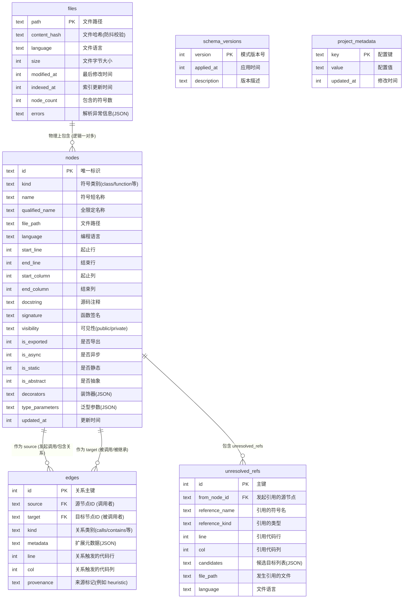

# CodeGraph 数据库设计与 ER 关系图

本篇文档详细介绍了 CodeGraph 在本地项目生成的 SQLite 数据库（`.codegraph/codegraph.db`）的表结构设计与实体关系图（ER Diagram）。

---

## 1. ER 关系图 (ER Diagram)

以下是数据库中表与表之间的关系图，采用 Mermaid 语法渲染：

---

## 2. 数据表结构说明

### 2.1 `nodes` 表
存储所有从 AST 语法树中提取出的代码元素（如类、函数、方法、变量、组件、路由等）。

| 字段名称 | 数据类型 | 描述 |
| :--- | :--- | :--- |
| **`id`** | TEXT (PK) | 节点的唯一标识符（由文件路径和符号范围拼接而成） |
| **`kind`** | TEXT | 符号类别，可选值如：`class`, `function`, `method`, `variable`, `route` 等 |
| **`name`** | TEXT | 符号的短名称，例如：`getUser` |
| **`qualified_name`** | TEXT | 带有作用域/全限定名称，例如：`UserService.getUser` |
| **`file_path`** | TEXT | 符号所在的文件相对路径 |
| **`language`** | TEXT | 编程语言类型 |
| **`start_line` / `end_line`** | INTEGER | 该节点在源码文件中的起止行号 (1-indexed) |
| **`start_column` / `end_column`**| INTEGER | 该节点在源码文件中的起止列号 |
| **`signature`** | TEXT | 方法或函数的签名结构声明 |
| **`docstring`** | TEXT | 提取自源码中的注释/文档描述 |
| **`visibility`** | TEXT | 访问级别控制（如 `public` / `private`） |
| **`is_exported`** | INTEGER | 0 或 1，表示符号是否被导出公开 |
| **`is_async` / `is_static`** | INTEGER | 标识是否是异步、静态修饰的符号 |
| **`decorators`** | TEXT | JSON 数组，存储该符号上的注解或装饰器列表 |
| **`type_parameters`** | TEXT | JSON 数组，存储该符号定义的范型参数 |
| **`updated_at`** | INTEGER | 毫秒级 Unix 时间戳，表示上次被解析更新的时间 |

---

### 2.2 `edges` 表
存储节点之间的关联关系边，构建完整的代码依赖网络图。

| 字段名称 | 数据类型 | 描述 |
| :--- | :--- | :--- |
| **`id`** | INTEGER (PK) | 关系边自增主键 |
| **`source`** | TEXT (FK) | 关系起点（外键，指向 `nodes.id`），即发起调用或包含的节点 |
| **`target`** | TEXT (FK) | 关系终点（外键，指向 `nodes.id`），即被调用或被继承的节点 |
| **`kind`** | TEXT | 关系边类型：`calls` (调用), `contains` (包含), `extends` (继承), `references` (普通引用) 等 |
| **`metadata`** | TEXT | JSON 字段，扩展的边元属性 |
| **`line` / `col`** | INTEGER | 该关系被触发的物理代码行列坐标 |
| **`provenance`** | TEXT | 关系来源，静态解析时为 `null`；若是通过框架解析器合成出来的关系，标记为 `'heuristic'` |

---

### 2.3 `files` 表
用于执行增量同步校验（Sync Process）的文件底表。

| 字段名称 | 数据类型 | 描述 |
| :--- | :--- | :--- |
| **`path`** | TEXT (PK) | 文件的相对路径 |
| **`content_hash`** | TEXT | 文件内容的 SHA-256 哈希值，用于比对文件是否发生变化 |
| **`language`** | TEXT | 文件的编程语言分类 |
| **`size`** | INTEGER | 文件大小（字节） |
| **`modified_at`** | INTEGER | 文件上次被 OS 修改的时间戳 |
| **`indexed_at`** | INTEGER | 索引器扫描解析该文件的时间戳 |
| **`node_count`** | INTEGER | 从该文件中解析出的节点总数 |
| **`errors`** | TEXT | JSON 数组，记录解析过程中遇到的语法或运行时错误 |

---

### 2.4 `unresolved_refs` 表
用于暂存分析第一阶段中无法跨文件确认定义的未知符号引用。

| 字段名称 | 数据类型 | 描述 |
| :--- | :--- | :--- |
| **`id`** | INTEGER (PK) | 主键 |
| **`from_node_id`** | TEXT (FK) | 外键，发起引用的节点 ID |
| **`reference_name`** | TEXT | 引用目标的符号名字 |
| **`reference_kind`** | TEXT | 引用的类型 |
| **`line` / `col`** | INTEGER | 发生引用时的代码行列坐标 |
| **`candidates`** | TEXT | JSON 数组，存储最终匹配成功前的潜在候选符号列表 |
| **`file_path`** | TEXT | 发生引用的源文件路径 |

---

## 3. 全局辅助与系统表

*   **`schema_versions`**：记录当前数据库的版本迭代信息，用于防范迁移兼容问题。
*   **`project_metadata`**：KV 形式存储的项目全局索引构建元数据。
*   **`nodes_fts`** (虚拟表)：使用内置 **SQLite FTS5** 实现的分词检索虚拟表，支持 AI 工具进行毫秒级模糊文本匹配。
