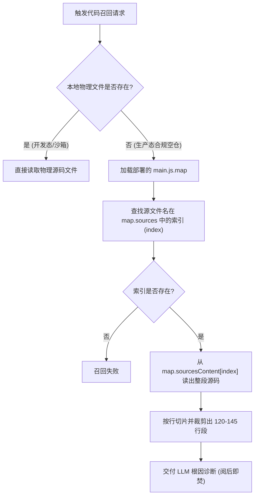
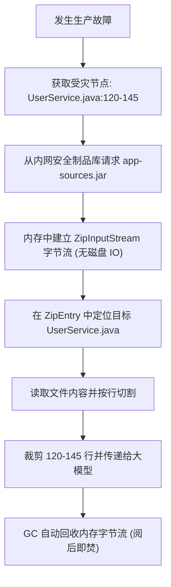

# CodeGraph 生产合规安全召回设计方案 (Production-Safe Code Retrieval)

在金融、支付、核心基础服务等高安全与高合规要求行业中，**“生产环境不能留源码明文”**与**“生产问题根因排查需要源码上下文”**之间存在经典的合规冲突。

本文档详细阐述了 CodeGraph 召回引擎（Recall Engine）在无源码物理文件部署的生产区域中，如何通过前端 SourceMap 与 Java 调试符号/反编译技术实现安全、合规的源码上下文检索与召回。

---

## 1. 核心痛点与解决思路

### 1.1 痛点描述
CodeGraph 在排查故障时，需要将受灾符号（如方法或函数）的**源码明文片段**提取并注入到大模型（LLM）的 Prompt 中。然而，生产环境安全审计规范严禁在容器或物理机磁盘中存放明文的源码仓库，通常只允许部署编译混淆后的制品（如混淆后的 `.js`，或者编译后的 `.class`/`.jar`）。

### 1.2 核心解决思路：动静分离，物理隔离
- **只存骨架，动态召回**：生产环境仅部署包含图拓扑结构、符号坐标（文件名、起止行号）的轻量级数据库 `codegraph.db`。
- **免文件 IO 的内存解包**：当需要召回代码时，通过解析**混淆映射包**（如 SourceMap）或**内存流式读取**（如制品库中的 `sources.jar`）临时反解出源码，不向生产磁盘写入任何物理源码文件，阅后即焚。

---

## 2. 方案一：前端/Node.js 领域的 SourceMap 方案

通过现代打包工具（如 Webpack, Vite, Rollup, esbuild）在 CI/CD 编译阶段生成携带源码嵌入的 SourceMap 文件，可在生产环境实现“零源码文件”解包。

### 2.1 技术原理：`sourcesContent` 属性
在生成的 `.js.map` 文件中，除了映射行列坐标的 `mappings`，还包含一个关键字段 `sourcesContent`：
- `sources`：原始源码文件相对路径的数组。
- `sourcesContent`：与 `sources` 一一对应的**源码明文内容**数组。

这在审计标准中被判定为“调试符号产物”（非物理明文源码库），能合法地部署于生产环境。

### 2.2 调用与解包逻辑
当诊断引擎在 `codegraph.db` 中搜索并定位到某个 Node 坐标（如 `filePath: "src/auth/AuthService.ts"`, `startLine: 120`, `endLine: 145`）时，调用逻辑如下：



### 2.3 代码实现参考 (Node.js)
```typescript
import * as fs from 'fs';
import * as path from 'path';

interface Node {
  filePath: string;
  startLine: number;
  endLine: number;
}

export async function extractSourceFromMap(
  projectRoot: string, 
  node: Node
): Promise<string | null> {
  const physicalPath = path.join(projectRoot, node.filePath);
  
  // 1. 本地测试环境：直接读取物理文件
  if (fs.existsSync(physicalPath)) {
    const content = fs.readFileSync(physicalPath, 'utf-8');
    return cutLines(content, node.startLine, node.endLine);
  }

  // 2. 生产环境合规拦截：读取 SourceMap
  const mapPath = path.join(projectRoot, 'dist/main.js.map');
  if (fs.existsSync(mapPath)) {
    try {
      const mapRaw = fs.readFileSync(mapPath, 'utf-8');
      const mapJson = JSON.parse(mapRaw);
      
      const sourceIndex = mapJson.sources.indexOf(node.filePath);
      if (sourceIndex !== -1 && mapJson.sourcesContent?.[sourceIndex]) {
        const originalContent = mapJson.sourcesContent[sourceIndex];
        return cutLines(originalContent, node.startLine, node.endLine);
      }
    } catch (err) {
      console.error('Failed to parse sourcemap', err);
    }
  }
  return null;
}

function cutLines(content: string, start: number, end: number): string {
  const lines = content.split('\n');
  return lines.slice(Math.max(0, start - 1), Math.min(lines.length, end)).join('\n');
}
```

---

## 3. 方案二：Java 领域的 Source JAR 方案 (工业级推荐)

由于 Java 没有原生的 `.map` 文件，工业界排查 Java 生产问题的标准做法是**只读源码 Jar 包（Source JAR）的内存解包**。

### 3.1 架构设计
- **构建阶段**：CI 任务生成两个制品：运行包 `app.jar`（仅包含 `.class` 字节码）与源码包 `app-sources.jar`（包含原始 `.java` 文件）。源码包上传至企业内网隔离的安全制品库（如 Nexus / Artifactory）。
- **运行阶段**：生产容器仅部署 `app.jar` 和预先导出的 `codegraph.db` 骨架数据，**不存放任何源码**。
- **排查阶段**：诊断工具根据当前运行的 Git Commit/版本号，向内网安全制品库发起拉取 `app-sources.jar` 请求，在**内存中通过流式解包**提取出需要排查的文件，执行切片，阅后即焚。

### 3.2 内存流式召回流程图


---

## 4. 方案三：Java 内存动态反编译与混淆还原

如果在极端合规场景下，安全合规部门**禁止在任何地方（包括制品库）存储 sources.jar**，则可以通过运行期反编译字节码并配合混淆映射表（Mapping）进行还原。

### 4.1 技术原理：字节码调试属性与 Mapping
- **LineNumberTable**：JVM 编译器（`javac`）在编译 `.class` 文件时，会在字节码中打包 `LineNumberTable`，记录字节码指令与原始 Java 代码行号的精确映射。
- **内存反编译**：召回引擎使用内存反编译组件（如 **Fernflower** / **Vineflower**），当场将受灾类的 `.class` 字节码还原为 Java 代码。
- **混淆还原**：如果生产环境经过混淆（如 ProGuard / R8），反编译出来的类名和变量名会变成 `a.b.c.a`。诊断引擎读取随构建发布的混淆映射文件 `mapping.txt`，在内存中将反编译出的代码结构与变量名映射复原。

### 4.2 反编译召回逻辑


---

## 5. 方案四：JVM 的 SourceDebugExtension 属性写入 (黑科技)

在 JVM 类文件规范中，允许类包含一个名叫 `SourceDebugExtension`（SMAP）的特殊属性（通常用于 JSP 调试）。
- **CI/CD 阶段**：编写 Maven 插件，将 `.java` 原始代码经过压缩后，直接作为 `SourceDebugExtension` 的字节数组强行写入 `.class` 文件中。
- **召回阶段**：使用 Java 字节码库（如 ASM）读取当前运行类的该字节码属性，在内存中解压即可直接获得 100% 精确的源码。

---

## 6. 各方案综合对比与选型建议

| 评估维度 | 方案一：SourceMap (前端) | 方案二：Source JAR (Java 推荐) | 方案三：内存反编译 (Java 极端合规) |
| :--- | :--- | :--- | :--- |
| **生产环境源码文件存在性**| ❌ 零源码文件 | ❌ 零源码文件 | ❌ 零源码文件 |
| **存储介质** | 生产环境附带 `.js.map` | 存储于内网安全制品库 | 存在于 `.class` 字节码本身 |
| **审计合规性** | 高（符号包不视为明文库） | 极高（生产完全无源码） | 极高（完全无需存储源码） |
| **还原精准度** | 100%（带原注释） | 100%（带原注释） | 较好（丢失注释，且混淆还原需Mapping） |
| **工程实现难度** | 低 | 中（需对接 Artifact 仓库） | 高（需要集成反编译器与 Mapping 解析） |

### 🛠️ 推荐落地路径
1. **对于 Node.js / TypeScript (前端/后端服务)**：直接采用**方案一 (SourceMap)**。修改编译流水线，生成带 `sourcesContent` 的 map 并进行生产分发，修改 `extractNodeCode` 的读取逻辑。
2. **对于 Java 业务服务**：首选**方案二 (Source JAR 结合 Nexus)**。因其对原注释及泛型支持最好，开发人员体验最佳，且符合绝大多数中大型企业的安全审计要求（制品与运行环境隔离）。
3. **对于最严苛的金融级单线合规**：采用**方案三 (反编译 + Mapping.txt 还原)**，做到“生产线上与制品库内皆无源码”。
