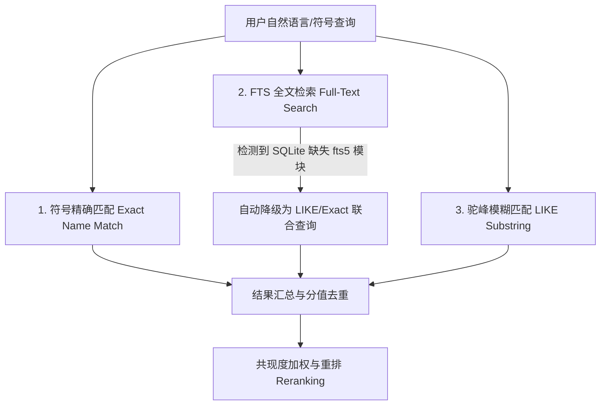

# CodeGraph 召回引擎与加权机制详解

本篇文档总结了 CodeGraph 在符号检索、关系链接以及结果打分重排（Reranking）上的核心算法与设计原理，帮助开发者理解 CodeGraph 是如何在**无向量模型（No-Vector）**的纯本地环境下实现高精度、高相关性的代码上下文召回的。

---

## 一、图谱的基石：Node (节点) 与 Edge (关系边)

CodeGraph 的核心思想是将源代码文件解析为结构化的**代码属性图 (Code Property Graph)**，并通过图扩散（Graph Propagation）寻找相关的代码上下文。

### 1. 什么是 Node (节点)？
Node 代表代码中的特定**实体**（主要是通过 Tree-sitter AST 解析提取出的符号或结构体）。
目前 CodeGraph 共定义了 **22 种节点类型**，可划分为以下三类：

| 分类 | 节点类型 (Node Kinds) | 描述 |
| :--- | :--- | :--- |
| **容器与定义** | `file`, `class`, `interface`, `struct`, `trait`, `protocol`, `enum`, `type_alias`, `module`, `namespace` | 构建代码宏观结构和类型系统的容器节点 |
| **可执行体** | `function`, `method`, `constructor`, `arrow_function` | 包含执行逻辑的代码块，是调用图（Call Graph）的核心 |
| **声明与元素** | `variable`, `property`, `parameter`, `field`, `enum_member`, `import`, `export`, `class_method` (AST placeholder) | 细粒度的变量、属性或常量定义 |

*   **唯一标识**：每个节点由 `id`（如 `file_path#qualified_name`）唯一标识，记录了其所在的物理文件、行列号、以及提取出的符号全称。

### 2. 什么是 Edge (边)？
Edge 代表节点之间的**语义关联或依赖关系**。这些边是通过静态单步解析（如引用查找、继承分析、调用链路分析）动态合成的。
目前 CodeGraph 包含 **12 种边类型**：

*   **`defines` (定义关系)**：容器节点（如 file, class）与它内部定义的符号（如 method, field）之间的包含关系。
*   **`calls` (调用关系)**：函数/方法 A 调用了函数/方法 B。
*   **`references` (引用关系)**：某段代码引用了某个变量、属性或类型定义。
*   **`extends` / `implements` (继承与实现)**：类或接口之间的派生与实现关系。
*   **`returns` (返回类型)**：方法/函数返回了某个类型。
*   **`has_parameter` / `has_type` (参数与类型关联)**：函数包含特定参数，或变量声明为特定类型。
*   **`callback_synthesized` (回调合成)**：通过 CodeGraph 特有的启发式规则合成的异步/回调依赖边（解决静态分析中因异步/事件驱动导致的调用链断裂）。

---

## 二、召回第一步：向量 vs 混合检索 (FTS/LIKE/Exact)

> [!NOTE]
> **关键结论：CodeGraph 在召回第一步完全没有使用向量数据库（Vector DB）或 Embedding 模型！**

### 1. 为什么不用向量模型？
1.  **极度轻量与零依赖**：向量化需要依赖外部 LLM API 或在本地运行体积巨大的 Embedding 模型（如 ONNX），这违背了 CodeGraph **“纯本地、免配置、即开即用”** 的设计初衷。
2.  **符号检索的精准度**：在代码搜索中，用户往往直接搜索符号名（如 `scrapeLoop`、`ShardSearchRequest`）。向量模型对这种生僻、驼峰命名的精确词汇召回效果极差，容易混入大量语义相近但实际上完全无关的代码。

### 2. 混合检索（Hybrid Search）的降级设计
CodeGraph 采用 SQLite 存储图谱数据，其召回第一步（寻找“种子节点”）使用了一套**三路混合检索方案**，并带有优雅降级机制：



*   **第一路：精确匹配 (Exact Match)**
    *   直接从查询词中提取出疑似符号名（如驼峰或下划线词汇），通过 SQL 快速检索 `nodes` 表中 `name COLLATE NOCASE = ?` 的节点。
*   **第二路：全文检索 (FTS5)**
    *   通过 SQLite 的 FTS5 虚拟表，对节点的 `name`、`qualifiedName` 及路径进行分词全文检索。
    *   **优雅降级**：如果用户的本地 Node 环境在执行时抛出 `no such module: fts5` 错误，CodeGraph 会在底层**自动捕获并无缝降级**，转为利用 B-Tree 索引的 `LIKE` 模糊查询和 Exact 检索组合，确保检索逻辑绝不中断。
*   **第三路：驼峰子串模糊匹配 (CamelCase Substring)**
    *   当 FTS 无法切分复杂的长驼峰词（例如 `TransportSearchAction` 被当做一个整词，无法被 `Search` 匹配）时，使用 `LIKE '%Search%'` 进行子串兜底，确保拼写片段依然能找到对应的类/接口。

---

## 三、共现度加权 (Co-occurrence / Co-location Boosting) 原理

由于没有向量语义召回，当用户输入诸如 `"search execution from request to shard"` 这种包含多个通用词（如 `search`, `request`, `execution`）的复杂查询时，传统的文本匹配很容易召回海量无关的节点（例如有 100 个类都带 `Request` 后缀），导致上下文窗口被垃圾信息塞满。

为了解决这个问题，CodeGraph 引入了**共现度加权（Co-location / Co-occurrence Boosting）**，即**“如果多个查询词同时出现在同一个文件或同一个节点中，那么它们的相关度呈指数级上升”**。

这套算法包含两个核心应用场景：

### 1. 符号级共现加权 (Symbol Co-location Boost)
当从查询中提取出多个符号名时（如用户查 `"scrapeLoop run"`），算法在精确匹配阶段采用 **两阶段拉取法 (Two-pass approach)**：

1.  **第一阶段 (Pass 1)：识别罕见词 (Distinctive Symbols)**
    *   查询每个提取出来的符号，统计它们在多少个不同的文件中出现。
    *   如果某个符号出现的**文件数少于 10 个**，则被认定为**“罕见/特异性符号”**（例如 `scrapeLoop` 在整个库中只存在于 1 个文件，而 `run` 存在于 50 个文件）。所有包含该罕见符号的文件路径被记录到 `distinctiveFiles` 集合中。
2.  **第二阶段 (Pass 2)：高频词的共现挽救**
    *   在查询常见词（如 `run`）时，为结果打分。
    *   **加权规则**：如果包含 `run` 节点的文件**也属于** `distinctiveFiles`（即该文件里既有 `scrapeLoop` 也有 `run`），则给这个 `run` 节点赋予额外的 `+20` 权重分。
    *   **公式表现**：
        $$Score_{final} = Score_{base} + (SymbolCount_{file} - 1) \times 20$$
        *(其中 $SymbolCount_{file}$ 是该物理文件里匹配到的不同查询符号数量。若共现数量 $\ge 2$，则会获得 20 分或以上的加分，确保该文件内的所有匹配节点瞬间浮现到搜索结果的最前列。)*

### 2. 文本级多词共现重排序 (Multi-term Co-occurrence Reranking)
对于全文检索或模糊搜索召回的列表，在截断（Truncation）前执行多词匹配加权，以过滤通用词噪声。

1.  **词干聚合 (Term Grouping)**
    *   将查询词提取为多个独立单词（如 `["search", "execution", "request", "shard"]`）。
    *   将互为子串或相同词根的词进行归组（例如 `indexed` 和 `index` 归为一组），**只计作 1 个匹配概念**。防止同根词多次匹配造成的假共现膨胀。
2.  **双维度命中检测**
    *   检测召回节点的 `name` 字段（类名/函数名，子串匹配）以及其 `filePath` 的父目录（精确目录匹配，例如路径包含 `/search/` 目录）。
    *   统计该节点命中的不同词组数 $MatchCount$。
3.  **乘性加权与单词惩罚**
    *   **多词共现加权**：如果命中了 $\ge 2$ 个词组，对原分数进行乘性放大：
        $$Score_{new} = Score_{old} \times (1 + MatchCount \times 0.5)$$
        *(例如命中 2 个词提升至 2 倍分，命中 3 个词提升至 2.5 倍分。这能让 `ShardSearchRequest` 完美压制 `ExecutionUtils`)*
    *   **单词命中的降级惩罚**：如果节点仅命中了 1 个词组（且该节点**不是**精确符号匹配节点），则会面临乘性降级惩罚：
        $$Score_{new} = Score_{old} \times 0.6$$
        这能够非常有效地清退仅因为命中单个通用词（如 "request"）而混入的无关节点。

---

## 四、实操：如何单步调试一个召回 (Recall Process)

如果你想验证召回算法的实际表现，观察图扩散与共现加权在特定查询下的效果，可以直接运行我们编写的本地单步调试脚本 [debug-recall.mjs](file:///Users/bigc/Downloads/claw/codegraph/scratch/debug-recall.mjs)。

### 1. 调试脚本的核心结构
该脚本脱离了完整的 CLI 交互与 LLM 管道，单纯对 CodeGraph 的图谱召回与源码切片进行了三步拆解：

```javascript
import { pathToFileURL } from 'node:url';
import { resolve } from 'node:path';

// 1. 动态加载构建好的 CodeGraph 模块
const idx = await import(pathToFileURL(resolve('dist/index.js')).href);
const CodeGraph = idx.default?.default ?? idx.default ?? idx.CodeGraph;

// 2. 初始化并绑定已索引的项目数据库
const repoPath = '/Users/bigc/Downloads/jvm-sandbox-master';
const cg = CodeGraph.openSync(repoPath);
const contextBuilder = cg.contextBuilder;

// 3. 单步运行混合检索与图扩散 (1-Hop 扩散)
console.log('--- 运行混合检索与图扩散 ---');
const subgraph = await contextBuilder.findRelevantContext('sandbox active', {
  searchLimit: 3,        // 检索前 N 个种子节点
  traversalDepth: 1,     // 图扩散步数 (1-Hop)
  maxNodes: 20,          // 限制子图节点最大数量
  minScore: 0.3          // 过滤低分节点
});

// 4. 打印召回的种子节点 (Roots)
subgraph.roots.forEach((id, idx) => {
  const node = subgraph.nodes.get(id);
  console.log(`[种子 #${idx + 1}] Kind: ${node.kind} | Name: ${node.name} | Path: ${node.filePath}`);
});

// 5. 打印扩散出的依赖边 (Edges)
subgraph.edges.forEach((edge, idx) => {
  const source = subgraph.nodes.get(edge.source);
  const target = subgraph.nodes.get(edge.target);
  console.log(`边 #${idx+1}: ${source.name} ➔ [${edge.kind}] ➔ ${target.name}`);
});

// 6. 单步运行源码切片 (Source Slicing)
console.log('--- 提取源码片段 ---');
const codeBlocks = await contextBuilder.extractCodeBlocks(subgraph, 3, 1000);
codeBlocks.forEach((block) => {
  console.log(`=== 片段: ${block.node.name} ===\n${block.content}`);
});
```

### 2. 执行调试
你可以在终端进入 `/Users/bigc/Downloads/claw/codegraph`，直接运行该脚本进行单步追踪：

```bash
node scratch/debug-recall.mjs
```

通过这一调试流程，你可以直观地观察到：
1.  **分值重排结果**：哪些节点通过“共现度加权”获得了高分排在了前面。
2.  **关系网络扩散**：不仅召回了名字相近的节点，还拉取了哪些通过 `calls` 或 `references` 关联的一阶邻居节点。
3.  **物理代码切除**：召回节点如何最终转化为特定行范围的物理代码段。
