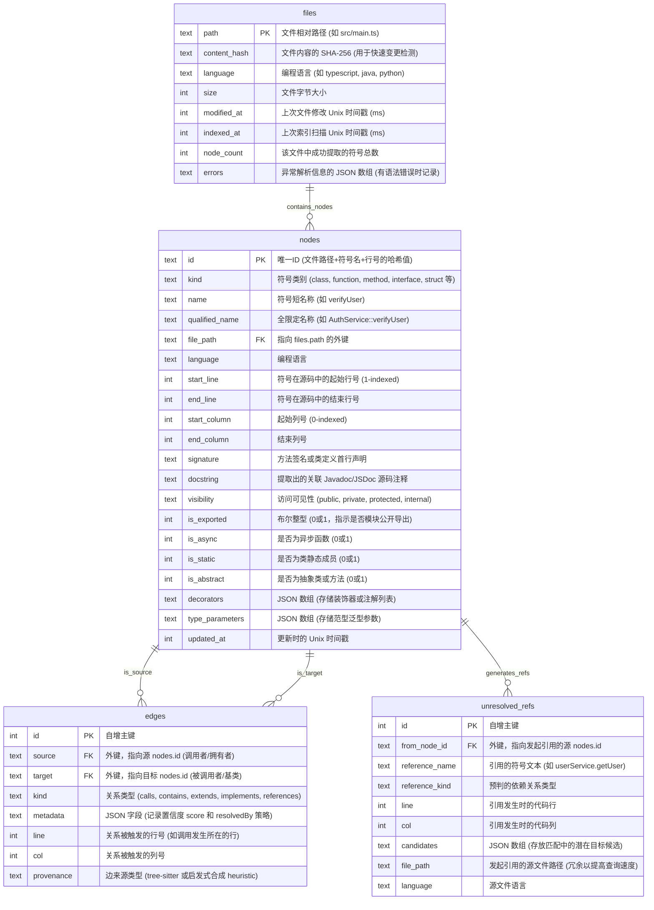
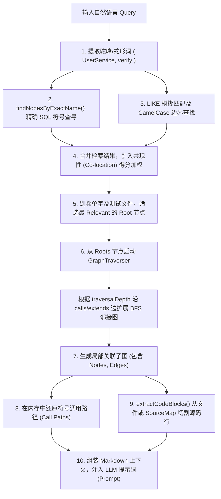

# CodeGraph 技术架构与 LocAgent 对比汇报整理

本篇文档为您系统地整理了 CodeGraph 的底层持久化逻辑、AST 点边转换机理、查询与召回机制、合规诊断实践，以及 **LocAgent** 与 **GitNexus** 的全方位对比，方便您直接用于技术汇报。

---

## 1. CodeGraph 底层逻辑与技术实现

### 1.1 项目本地持久化与数据库存储架构
当在项目根目录下执行 `codegraph init` 时，系统在本地生成隐藏目录 `.codegraph/`。所有的符号索引、图依赖关系以及增量同步状态均以 SQLite 数据库形式持久化于 `.codegraph/codegraph.db` 中。

#### 1.1.1 磁盘存储结构布局
```
[Your Project Root]/
  ├── .codegraph/
  │    ├── codegraph.db      # 核心 SQLite 数据库 (包含节点、边、FTS虚表)
  │    └── codegraph.lock    # 并发控制锁文件 (防止 CLI、MCP 与 Git Hook 同时写库)
  ├── .cursor/
  │    └── rules/
  │         └── codegraph.mdc # 对接到 Cursor 编辑器的 Agent 规则文件
  └── [Project Files...]
```

#### 1.1.2 数据库实体关系 (ER) 图


---

### 1.2 AST 转换为点与边的调用逻辑
`codegraph` 内部设计了高度模块化的点边抽取引擎，具体处理过程分为两个独立的流水线阶段：

#### 阶段一：基于 DFS 的单文件结构抽取 (AST Extraction)
1. **启动解析**：当执行扫描任务时，系统根据文件后缀调用 `detectLanguage(filePath)`，匹配并加载对应的 `web-tree-sitter` WASM 语言解析器。
2. **深度优先遍历 (DFS)**：调用 `parser.parse(source)` 获得语法树，从 `tree.rootNode` 启动 DFS。在 [`visitNode(node)`](file:///Users/bigc/Downloads/claw/codegraph/src/extraction/tree-sitter.ts#L269) 递归过程中，对照语言配置 `LanguageExtractor` 的规则进行模式匹配。
3. **节点创建**：若节点类型落入符号声明列表（如 TypeScript 的 `class_declaration` 或 Java 的 `method_declaration`），则提取其符号名称。
   - 解析器首先将当前节点 ID 推入作用域嵌套栈 `this.nodeStack` 中，并利用 `buildQualifiedName(name)` 结合栈中的父级名称生成全限定名（例如 `UserService::verifyPassword`）。
   - 调用 `createNode(kind, name, node, extra)` 将符号点持久化到数据库的 `nodes` 表中。
4. **物理嵌套边绑定**：在 `createNode` 时，若 `nodeStack` 中存在父级节点（如类名在栈顶，当前创建的是方法），系统会即时生成一条 `source = parentId`，`target = childId`，`kind = 'contains'` 的物理树级嵌套边，并存入临时 `edges` 数组。
5. **依赖引用暂存**：当遇到方法调用（`call_expression`）、继承（`extends_clause`）或类型声明（`type_annotation`）等无法单文件闭环的交叉符号时：
   - 提取器解析出引用的名称字符串（如 `userRepository.save`），调用 `unresolvedReferences.push` 创建待解析记录存入 `unresolved_refs` 表中。

#### 阶段二：跨文件全局符号关系解析 (Reference Resolution)
所有文件提取完毕、全局符号字典构建好后，调用 [`ReferenceResolver.resolveAll()`](file:///Users/bigc/Downloads/claw/codegraph/src/resolution/index.ts#L448)。对于每一个暂存的 `UnresolvedReference`：
1. **JVM 全限定名导入解析**：如果是 Java/Kotlin 等的 `import com.user.Service` 语句，直接利用全限定名索引直连目标 Node，匹配成功赋予 `confidence = 1.0`。
2. **框架特异解析**：通过注册的 `FrameworkResolver`（如 MyBatis XML 的 SQL ID 到 Java 接口的映射，Svelte/Vue 的事件流绑定），命中特殊逻辑则生成高置信度结果。
3. **头部导入绑定 (`resolveViaImport`)**：根据发起引用文件头部的 `import` 或 `require` 声明及 TSConfig 中的别名配置（`path-aliases`），把简写的引用（如 `save`）推算成对应引用的原始文件路径，进而在目标文件的导出节点中定位，匹配成功置信度赋予 `0.9`。
4. **模糊命名匹配 (`matchReference`)**：若前几步都不中，启动最后的兜底策略。对于带有 receiver 的调用 `obj.method()`，寻找当前作用域内 `obj` 的定义类型，并检索该类型下的成员。如果是不带前缀的裸调用，则采用就近原则在同名节点中匹配。
5. **边升级持久化**：
   - 如果是一条 `'extends'` 边，但解析出的目标是一个 `'interface'`，解析器在生成边时自动将其升级纠正为 `'implements'`；
   - 如果是一条 `'calls'` 边，但目标指向了一个 `'class'`（例如 Python 隐式调用构造函数 `db = Database()`），自动将边升级纠正为 `'instantiates'`。
   - 将最终的真实依赖边写入 SQLite 关系数据库，同时从临时表清空该 unresolved 记录。

---

### 1.3 查询与召回中的点边命中与原始源码查询
当 LLM 客户端通过 Model Context Protocol (MCP) 输入自然语言 Query（例如：“排查 UserService 中 verify 接口的崩溃问题”）时，`ContextBuilder` 采用以下链路实现高召回、低Token损耗的上下文裁剪：



#### 1.3.1 混合搜索 (Hybrid Search) 算法细节
1. **分词与提取**：从 Query 中识别出 `CamelCase`、`snake_case`、`SCREAMING_SNAKE` 等模式以及常规英文单词，剔除无实质意义的介词。
2. **共现性权重提升 (Co-location Boost)**：如果查询提取出两个符号 `UserService` 和 `verify`，而数据库中这两个符号同时出现在同一个物理文件（如 `user.service.ts`）中，系统会根据该文件匹配到的符号数量，呈倍数级提升该批节点的分数。
3. **CamelCase 边界及复合词匹配**：若 FTS 无法直接分词，使用 SQLite 的 `LIKE` 条件进行子串搜索。
   - 对非前缀匹配（例如，在 `TransportSearchAction` 中定位 `Search` 且其前方紧挨着小写字母，代表驼峰分界线），给予 Brevity Bonus（名字越短越好，避免测试工具类篡位）。

#### 1.3.2 源码截取逻辑 (Source Querying)
1. 在提取到的局部子图中，对节点依据重要度降序排队：**种子节点 (Roots) ➔ 方法与函数 (Method/Function) ➔ 类 (Class)**。
2. 调用私有方法 `extractNodeCode(node)`：
   - 校验物理路径是否存在于项目根目录下以防止越权。
   - 执行文件流同步读取：`fs.readFileSync(filePath, 'utf-8')`。
   - 将读取出的内容以换行符 `\n` 切分为数组。
   - 根据 Node 表中记录的起止行号，精确执行 `lines.slice(startLine - 1, endLine)` 切片还原源码。若行数长度超出 Token 限制，强行裁剪并在末尾加 `... (truncated) ...` 标识。

---

## 2. CodeGraph 使用实践与合规诊断

### 2.1 只用 DB 索引文件行不行？
**结论是：绝对不行。**
- **不可实现 Downstream Grounding**：大模型在回答“为什么这里会崩溃”或者“请帮我重构这个类的实现”时，必须阅读到代码的真实逻辑（如 `if (user == null)` 等分支）。
- **Token 填充需求**：数据库仅记录了符号的坐标（位置）和它们谁调用了谁的指针。如果在召回给 LLM 的上下文中，只告诉它 `UserService.getUser()` 调用了 `UserRepository.find()`，但没有任何具体的实现文本，AI 就失去了推导变量赋值、异常抛出逻辑的基础，无法生成任何准确的重构代码或根因判定。因此，**源码召回组件是图谱发挥 AI 诊断威力的物理基础。**

---

### 2.2 行内 OpenCode 与 Comate 使用体验对比
在企业内部落地 AI 辅助工具的体验中，两种工具的侧重点和架构深度有本质区别：

#### 2.2.1 Baidu Comate (或行内即时补全工具)
- **体验特性**：基于**极低延迟的代码补全（Code Completion）**。当开发在编辑器中敲下一行字符，它能毫秒级给出后半句或下一个代码块的续写。
- **局限性**：缺乏“全局视野（System Awareness）”。因为 Comate 的注意力机制只能容纳当前文件和极少数关联 Tab 文件的缓存上下文，当涉及复杂的跨模块、跨服务重构时，它给出的代码经常包含“已经不存在的接口调用”或者“违反工程规范的野调用”，开发人员需要花费大量精力排错。

#### 2.2.2 OpenCode (结合 CodeGraph 核心的 MCP Agent)
- **体验特性**：定位于**全局架构级排查与重构 Agent**。它不需要毫秒级响应，而是接收到一个高难度指令（如：“请重构分布式会话保存接口，使其支持 Redis 集群并修改所有调用方”）后以自治的任务模式（Task Mode）运行。
- **优势体现**：
  1. **跨模块感知**：利用 CodeGraph 提供的局部依赖子图，AI 可以在生成第一行代码前，准确把控修改该接口会波及哪些文件（“爆炸半径 blast radius”分析）。
  2. **精确上下文**：召回只将真正相关的调用处代码块塞给大模型，避免了无效代码淹没 Token 窗口，准确度极高，重构代码能一次编译成功。

---

### 2.3 根因分析的生产安全合规方案
针对银保监合规合规要求“生产环境不得存留、解密源码物理文件”的底线，CodeGraph 设计了三套高安全等级的内存召回方案：

#### 2.3.1 方案一：SourceMap `sourcesContent` 内存还原（前端/NodeJS 业务）
- **操作流程**：构建机在打包压缩混淆 Node.js 项目时，生成包含源码文本的 `.js.map` 符号包。将该 map 包部署于生产，但不部署任何 `src/` 原始代码。
- **合规逻辑**：审计部门将 `.map` 视作编译调试辅助文件，而非代码仓库。排查问题时，CodeGraph 直接解析 map 文件的 JSON 结构，并从 `sourcesContent` 属性数组中提取对应原始文件索引的内容，全程在内存中进行 line slice 裁剪，**磁盘上完全不生成任何明文源码物理文件**。

#### 2.3.2 方案二：制品库 Source JAR 结合方案（Java 后端业务）
- **操作流程**：
  1. 在 CI/CD 构建阶段，在安全流水线内生成只读源码包 `app-sources.jar`，并将其发布到企业隔离受控的安全制品库（如 Nexus）。
  2. 生产运行容器内只部署 `app.jar` 字节码包和由 CI 扫描导出的 `codegraph.db` 骨架关系数据库，磁盘源码率为零。
  3. 当 SRE 在生产发起大模型根因诊断时，诊断程序获得临时授权访问内网制品库，流式拉取 `app-sources.jar` 的二进制流。
  4. 使用 Java 的 `ZipInputStream` 在内存中解压指定类文件，读取行切片传递给 LLM。**排查进程退出后垃圾回收 (GC) 直接销毁内存，阅后即焚**。

#### 2.3.3 方案三：内存 Fernflower 反编译与 Mapping 还原（极致安全审计）
- **操作流程**：针对任何地方都不允许存放源码压缩包的极端监管场景，诊断工具在内存中动态加载字节码反编译器组件。
- **还原逻辑**：直接读取运行中的 `.class` 二进制字节码，在内存中反解出原始逻辑。若代码经过 ProGuard / R8 混淆，则读入打包发布的脱敏 `mapping.txt` 文件，在内存中完成符号重映射（把反编译代码里的 `a.b.c.a` 复原为 `UserService.verify`），再对照 `LineNumberTable` 切割出出错行，实现无损的逻辑诊断。

---

## 3. LocAgent 与 GitNexus 对比汇报

在技术汇报时，可以通过以下表格与总结将 **LocAgent**（ACL 2025 前沿学术成果）与 **GitNexus**（基于 CodeGraph 核心的生产级落地平台）的定位划清界限：

| 对比维度 | 学术前沿定位：LocAgent (ACL 2025) | 生产落地基础设施：GitNexus (基于 CodeGraph) |
| :--- | :--- | :--- |
| **设计定位** | **代码定位自治智能体 (Code Localization Agent)** | **代码图谱基础设施与 MCP 服务引擎** |
| **核心目的** | 提升 AI 智能体在面对未知错误时，**在庞大代码图里自主寻路、锁定故障文件和行**的能力。 | 为主流通用 AI 客户端（如 Cursor、Claude Code 等）提供**高精度的依赖上下文与爆炸半径分析**。 |
| **运行机制** | **AI 闭环自主探路**：大模型作为控制回路的主体，自主决策下一步是执行 keyword 搜索，还是沿着图中的某个调用边向前探路一跳。 | **确定性的静态 RAG 召回**：通过混合搜索 + 快速关系拓扑扩展，一次性找出最优的上下文子图并填入 Prompt 交付给 AI。 |
| **知识图谱特征** | **Heterogeneous Graph (异构图)**：将符号点分类存储，偏向于图节点多跳推理。 | **分层关系关联图**：结合静态 AST 语法树解析与启发式框架层解析，支持跨多语言关联。 |
| **使用成本** | **高**。寻找 Bug 需要 AI 多次调用工具并在图中游走（Multi-hop），极其依赖强模型推理，Token 开销大。 | **极低**。一次性生成 SQLite 本地索引，后续只需在本地毫秒级执行 SQL 和 BFS 连线，零额外大模型开销。 |
| **部署与集成** | 独立的 Python 流程框架，开发人员无法直接在其 IDE 中直观使用。 | 遵循标准 **Model Context Protocol (MCP)** 协议，提供了本地可视化 UI 及零服务器运行的 MCP Server。 |
| **应用阶段** | 故障定位阶段（Localization）。 | 架构全景可视化、故障根因分析（RCA）、跨系统大规模安全重构。 |

### 💡 汇报总结词（金句建议）
> “**LocAgent** 是一个由 AI 自主驾驶、利用图论在代码库里反复跳转以探索寻路的 **‘故障侦察兵 Agent’**；而 **GitNexus (CodeGraph)** 则是为我们现有的主力 AI 工具绘制全局数字路线、进行爆炸半径预测与架构避障的 **‘高精地图定位雷达 (MCP Infrastructure)’**。”
